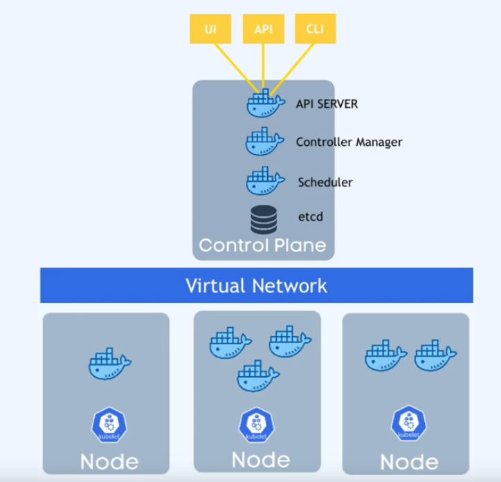
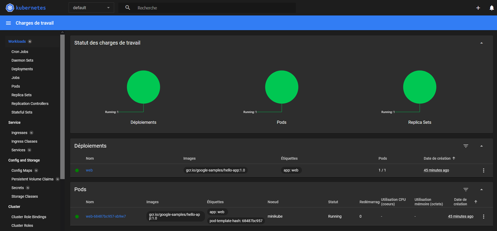

Dans ce premier article, je vais expliquer comment monter un premier cluster ***Kubernetes***. C’est une technologie particulièrement importante dans le domaine du cloud et ***DevOps*** que tout débutant doit connaître pour trouver un emploi digne de ce nom. 

***Kubernetes*** est une plateforme *Open-Source* pour la gestion de charges de travail et de services conteneurisés. Elle a été créée en 2014 par ***Google*** pour gérer la charge et la mise à l’échelle de ses services de production. C’est un outil complexe à appréhender et dont la courbe d’apprentissage est assez abrupte. En tant que débutant, je centralise ici tout ce que j’ai pu apprendre sur cet outil. 

## **I. L’orchestration, kubernetes, les clusters… C’est quoi ?**

***Kubernetes*** permet de gérer des containers d’applications, qu’il s’agisse de containers docker ou d’autres technologies. Il aide à gérer un grand nombre de container et de les gérer dans des environnement différents : physiques, dans le cloud ou dans un environnement hybride. C’est un outil très important aujourd’hui dans le cadre des architectures ***microservices*** qui dominent le marché. Les applications “tout en un” appelées ***Monolithe*** sont aujourd’hui désuètes. Une application va être divisée en plusieurs petites applications : **frontend**, **backend**, **base de données**… Évidemment, dans le cas d’applications complexes, on se retrouve avec énormément de conteneurs à gérer. C’est là que ***Kubernetes*** va nous aider : on va pouvoir gérer nos nombreux conteneurs.

L’orchestrateur offre des fonctionnalités clés : 

- **Disponibilité :** l’application sera toujours disponible
- **Mise à l’échelle :** permet de faire des montées en charge afin d’éviter que l’application crash lorsque de nombreux utilisateurs veulent s’y connecter.
- **Récupération :** permet de faire des sauvegardes régulières et de restaurer en cas de problème.

### *A. L’architecture de Kubernetes*

**Différents éléments composent une architecture Kubernetes qui est composé de “Nodes” (machine virtuelle ou physique) :**

- **Node “Master” :** il contrôle les workers node et gère le cluster de manière globale
- **Node “Workers” :** les noeufs sur lesquels s’exécutent les conteneurs. Ils sont contrôlés via un agent nommé ***kubelet***

**Sur le master, on retrouve :**

- L’**API** pour manager le cluster (via cli, api ou dashboard)
- Le **Controller Manager** qui contient les logs de ce qu’il se passe dans le cluster
- Le **scheduler** qui décidé sur quel node un nouveau pod sera déployé
- **etcd** où les backup sont stockées (snapshots, backups…)



L’ensemble de ses éléments appartiennent au même réseau virtuel. Dans un environnemment réel il est recommandé d’avoir deux noeuds master car si un master est down, le cluster peut encore fonctionner.

**II. Installer et démarrer minikube**

Dans un premier temps, vous devez installer docker sur votre machine (utiliser ***WSL2*** sous ***Windows***) puis vous devez installer le gestionnaire de paquet ***HomeBrew***. Pour cela, il faut vérifier que la distribution est à jour via `sudo apt update`

Une fois cette chose faite, il faut installer les outils essentiels au gestionnaire de paquets : 

- **build-essential** : installe un ensemble de compilateurs et de bibliothèques nécessaires pour la construction de logiciels à partir du code source, y compris gcc, g++, make et d'autres.
- **curl** : un outil en ligne de commande pour transférer des données vers ou depuis un serveur. Il peut être utilisé pour télécharger des fichiers, par exemple.
- **file** : un outil en ligne de commande pour déterminer le type d'un fichier, en fonction de son contenu.
- **git** : un système de contrôle de version utilisé pour suivre les modifications du code et collaborer avec d'autres sur des projets logiciels.

Ces outils s’installent avec la commande suivante : 

```bash
sudo apt-get install build-essential curl file git
```

Il faut suffit ensuite de copier cette commande pour installer directement le paquet de **HomeBrew** : 

```bash
/bin/bash -c "$(curl -fsSL https://raw.githubusercontent.com/Homebrew/install/master/install.sh)"
```

La prochaine étape de l’installation consiste à ajouter le chemin de **HomeBrew** dans le PATH (la variable qui gère les commandes que l’on peut appeler) : 

```bash
test -d ~/.linuxbrew && eval $(~/.linuxbrew/bin/brew shellenv)
```

```bash
test -d /home/linuxbrew/.linuxbrew && eval $(/home/linuxbrew/.linuxbrew/bin/brew shellenv)
```

```bash
test -r ~/.bash_profile && echo "eval \$($(brew --prefix)/bin/brew shellenv)" >>~/.bash_profile
```

```bash
echo "eval \$($(brew --prefix)/bin/brew shellenv)" >>~/.profile
```

Une fois BREW ajoutée au PATH, exécuter la commande suivante pour installer **minikube** sur votre machine WSL : 

```bash
brew install minikube
```

En cas d’erreur vérifier que le Docker est à jour et que WSL peut y accéder : 

// Ajouter photo

Lorsque **minikube** est installé, exécuter la commande suivante pour utiliser le driver **Docker** plutôt que le driver de base de **minikube** : 

```bash
minikube config set driver docker
```

Maintenant, on peut démarrer l’orchestrateur avec la commande : 

```bash
minikube start
```

Le message qui apparaît devrait être le suivant : 

```bash
Output
👍  Starting control plane node minikube in cluster minikube
🚜  Pulling base image ...
💾  Downloading Kubernetes v1.23.1 preload ...
    > preloaded-images-k8s-v16-v1...: 504.42 MiB / 504.42 MiB  100.00% 81.31 Mi
    > gcr.io/k8s-minikube/kicbase: 378.98 MiB / 378.98 MiB  100.00% 31.21 MiB p
🔥  Creating docker container (CPUs=2, Memory=1987MB) ...
🐳  Preparing Kubernetes v1.23.1 on Docker 20.10.12 ...
    ▪ kubelet.housekeeping-interval=5m
    ▪ Generating certificates and keys ...
    ▪ Booting up control plane ...
    ▪ Configuring RBAC rules ...
🔎  Verifying Kubernetes components...
    ▪ Using image gcr.io/k8s-minikube/storage-provisioner:v5
🌟  Enabled addons: default-storageclass, storage-provisioner
🏄  Done! kubectl is now configured to use "minikube" cluster and "default" namespace by default
```

Le paquet **minikube** vient avec `**kubectl**`, l’outil classique qui permet de manager des clusters Kubernetes en ligne de commande. Pour obtenir tous les **pods** d’un **namespace**, il suffit de taper la commande suivante : 

```bash
kubectl get pods -A
```

## III. Déployer et tester le fonctionnement de son app

Maintenant **minikube** fonctionne, il est possible de le tester en créant un premier cluster. Pour cela, il est possible d’utiliser une image crée par *Google* appelée **hello-app** (un hello world). Le déploiement d’une image avec `kubctl` s’effectue comme suit : 

```bash
kubectl create deployment web --image=gcr.io/google-samples/hello-app:1.0
```

Traduction de la commande : 

- `create deployment` : permet de créer un déploiement dans le cluster
- `web` : c’est le nom du déploiement
- `--image=gcr.io/google-samples/hello-app:1.0` : l’image distance à partie de laquelle le cluster est créé.

Maintenant que l’application est déployée sur le cluster **minikube**, il faut l’exposer comme sur un container **Docker** pour pouvoir accéder à son contenu : 

```bash
kubectl expose deployment web --type=NodePort --port=8080
```

Ici, le port 8080 du container créé pour le déploiement est exposé. Le déploiement agit désormais en tant que **service kubernetes**. 

Pour vérifier que le service fonctionne, la commande à taper est : 

```bash
kubectl get service web
```

Il reste à interroger le service pour obtenir son contenu. Pour connaître l’URL du service à interroger : 

```bash
minikube service web --url
```

Il suffira ensuite de se rendre avec un navigateur à l’adresse retournée. Il est possible également d’utiliser `curl` :

```bash
curl http://192.168.49.2:31534
```

Pour se rendre compte que le service tourne bien sous kubernetes, il est possible d’afficher un dashboard :

```bash
kubstl dashboard
```

La fenêtre suivante apparaît : 



Sources : 

- [https://linux.how2shout.com/install-brew-on-wsl-windows-subsystem-for-linux/](https://linux.how2shout.com/install-brew-on-wsl-windows-subsystem-for-linux/)
- [https://kubernetes.io/fr/docs/tasks/tools/install-minikube/](https://kubernetes.io/fr/docs/tasks/tools/install-minikube/)
- [https://www.linuxtechi.com/how-to-install-minikube-on-ubuntu/](https://www.linuxtechi.com/how-to-install-minikube-on-ubuntu/)
- [https://www.digitalocean.com/community/tutorials/how-to-use-minikube-for-local-kubernetes-development-and-testing](https://www.digitalocean.com/community/tutorials/how-to-use-minikube-for-local-kubernetes-development-and-testing)
- [https://www.youtube.com/watch?v=s_o8dwzRlu4](https://www.youtube.com/watch?v=s_o8dwzRlu4)