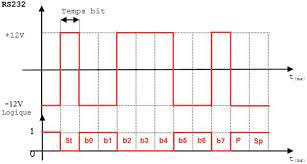

[RS232-image](../../../assets/Elec/RS232/RS232-img.jpg)

Dans le cadre de la formation d'ingénieur informatique de l'ESIEE Amiens, des cours d'électroniques sont dispensés, notamment sur les bus de communication. Ce sont des systèmes de communication entre des composants électroniques.  Ils sont utilisés dans les systèmes embarqués, les systèmes informatiques, les systèmes de contrôle, etc. Le BUS RSR232, aujourd'hui obsolète, reste malgré tout très présent dans l'industrie.

# Bus RS232

Le bus RS232 est une norme de communication série pour la transmission de données entre des équipements électro'ques. RS232 est l'acronyme de "Recommended Standard 232", et il a été développé pour la première fois par *l'Electronic Industries Association (EIA)* en 1962. La norme spécifie les caractéristiques physiques et électriques d'un bus de communication série, ainsi que les signaux de contrôle utilisés pour synchroniser les données.

Le bus RS232 utilise une ligne de transmission de données unidirectionnelle, généralement avec une vitesse de transmission maximale de **20kBit/s**.

Il utilise une liaison série asynchrone, ce qui signifie que les données sont transmises en continu, avec un bit de début et un ou plusieurs bits d'arrêt pour chaque octet de données transmis.

Les signaux électriques utilisés pour transmettre les données sur le bus RS232 sont différentiels, ce qui signifie que la différence de tension entre deux lignes est utilisée pour transmettre des données. La norme RS232 définit des niveaux de tension spécifiques pour les signaux logiques "1" et "0", ainsi que des niveaux de tension de marque et d'espace pour la synchronisation des données.

Le bus RS232 a été largement utilisé dans les ordinateurs personnels, les imprimantes et d'autres équipements électroniques pendant de nombreuses années. Cependant, avec l'avènement de nouvelles normes de communication plus rapides et plus flexibles telles que USB, Ethernet et WiFi, le bus RS232 est devenu moins courant.

## Types de liaisons :
Le RS232 utilise une liaison de transmission de données unidirectionnelle, ce qui signifie que les données ne peuvent être transmises que dans un seul sens. Cependant, il est possible d'établir une liaison bidirectionnelle en utilisant deux lignes de transmission, l'une pour l'envoi de données (TX) et l'autre pour la réception de données (RX).

## Équipements ETTD/ETCD :

Les équipements **ETTD/DTE** sont des équipements terminaux de données tels que des ordinateurs, des terminaux d'affichage...

Les équipements **ETCD/DTE** sont des équipements de communication de données tels que des modems ou des imprimantes. 

## Câbles :

- Connecteur DB25 à 25 broches
- Mâle sur l'ETTD 
- Femelle sur l'ETCD
- Longueur max du câble : 25 mètres	

## Liaisons : 

Le RS232 est adapté pour de l'asynchrone et du synchrone. 

En mode RS232 standard, les données sont transmises de manière unidirectionnelle, soit du périphérique de transmission vers le périphérique de réception, soit dans le sens inverse, mais pas simultanément. Pour permettre une communication duplex en temps réel, il faut utiliser un câble croisé qui inverse les broches de transmission et de réception pour les connecteurs à chaque extrémité.

Il est possible de relier un ETTD et un ETCD, ou deux ETTD entre eux. Pour connecter deux équipements RS232, il est nécessaire d'utiliser un câble RS232 approprié avec des connecteurs mâles et femelles à chaque extrémité. Le type de câble à utiliser dépend du type d'équipements à connecter.

Dans le cas d'une connexion entre un équipement ETTD (Data Terminal Equipment) et un équipement ETCD (Data Communication Equipment), il faut un câble droit.

Pour connecter deux équipements ETTD, il faut utiliser un câble croisé. 

Une fois le type de câble déterminé, il faut connecter les équipements en branchant les connecteurs appropriés sur les ports série des équipements. Les ports série sont généralement identifiés par les lettres "COM" suivies d'un numéro, comme "COM1" ou "COM2".

Lors de la connexion de deux équipements RS232, il est essentiel de s'assurer que les paramètres de communication, tels que le baud rate, les bits de données, les bits de stop et la parité, sont identiques pour les deux équipements. Si les paramètres ne sont pas identiques, les équipements ne pourront pas communiquer correctement.

## Les 8 signaux les plus courants :

- TXD (Transmit Data) : utilisé pour transmettre les données du DTE au DCE.
- RXD (Receive Data) : utilisé pour recevoir les données du DCE au DTE.
- RTS (Request To Send) : utilisé par le DTE pour indiquer qu'il est prêt à envoyer des données.
- CTS (Clear To Send) : utilisé par le DCE pour indiquer que le DTE peut envoyer des données.
- DSR (Data Set Ready) : utilisé par le DCE pour indiquer que la connexion est établie.
- DTR (Data Terminal Ready) : utilisé par le DTE pour demander au DCE de se connecter au canal de communication.
- RI (Ring Indicator) : utilisé par le DCE pour indiquer qu'un appel est en cours.
- DCD (Data Carrier Detect) : utilisé par le DCE pour indiquer qu'un signal connu a été détecté sur le canal de communication.
- GND (Ground) : Masses communes des signaux.
- Shield (GND) : Signal de blindage du câble de transmission. Ce signal est relié à la masse d'un DCE.

## Communication :

### Envoi de données :

- L'ETTD envoie un signal de demande de connexion (DTR) au DCE.
- L'ETCD envoie un signal de connexion établie (DSR) au ETTD.
- L'ETTD envoie un signal de demande de transmission (RTS) au DCE.
- L'ETCD envoie un signal de transmission autorisée (CTS) au ETTD.
- L'ETTD envoie des données au DCE.
- L'ETTD désactive le signal de demande de transmission (RTS) au DCE.
- L'ETCD désactive le signal de transmission autorisée (CTS) au ETTD.
- L'ETTD désactive le signal de connexion établie (DSR) au DCE.
- L'ETCD désactive le signal de demande de connexion (DTR) au DTE.

### Réception de données :

- L'ETTD envoie un signal de demande de connexion (DTR) au ETCD.
- L'ETCD envoie un signal de connexion établie (DSR) au ETTD.
- L'ETCD active le DSR pour indiquer que la connexion est établie avec le ETTD
- L'ETTD reçoit des données du DTE sur le RXD.

## Reconnaitre un DB25 ou un DB9 :

- DB25 : 25 broches (2 rangées de 13 broches). Le RxD est la 3ème broche et le TxD est la deuxième rangée.
- DB9 : 9 broches (1 rangée de 9 broches). Le RxD est la 2ème broche et le TxD est la 3ème broche.

## Aspects électriques :

- En circuit fermé, la tension varie de -15V à +15V. 
- En circuit ouvert, la tension varie de -25V à +25V.
- Impédence de 300 Ohms.

### Cicuit de contrôle :	

- 0 : +3 à +15V
- 1 : -3 à -15V

### Cicuit de données :

- 0 : -3 à -15V
- 1 : +3 à +15V
  
## Faiblesses de la norme :

- Spécifique à une liaison série ETTD/ETCD
- Limité à 20Kbps
- Distance limitée à 25m
- Liaison point à point
- Standard monolithique : spécifique les aspects electriques, signalisation, protocole de communication, etc.

Pour pallier à ces faiblesses, d'autres normes ont été développées :

- RS449
- RS422
- RS423
- RS485

## Chronogrammes :

Les chronogrammes sont des représentations graphiques des signaux de communication.

Il existe deux types de chronogrammes :

- Chronogramme de niveau logique
- Chronogramme en tension de ligne

Le second est l'inverse du premier dans la norme RS232.

**Illustration des chronogrammes :**

Quelques notions :
- MSB : Most Significant Bit (bit de poids fort - bit le plus à gauche)
- LSB : Least Significant Bit (bit de poids faible - bit le plus à droite)
- bit de parité : bit ajouté à la fin d'un octet pour vérifier la validité des données transmises. 
  - Dans le cas d'une parité paire, le bit de parité est 1 si le nombre de bits à 1 est impair, 0 sinon.
  - Dans le cas d'une parité impaire, le bit de parité est 1 si le nombre de bits à 1 est pair, 0 sinon.
- bit de stop : bit ajouté à la fin d'un octet pour indiquer la fin de l'octet
- bit de start : changement d'état du signal pour indiquer le début de l'octet ( en norme RS232, le bit de start est toujours à 0 en niveau logique). 

Dans la norme RS232, les données sont transmises en octets. Chaque octet est composé de 8 bits. Le bit de start est toujours à 0. Le bit de stop est toujours à 1. Le bit de parité est optionnel. 

**Explications** : https://www.youtube.com/watch?v=qM4Nx3j03oo

#### Liens utiles :

- [Liaison RS232](http://www.siloged.fr/cours/html/sti2d_liaisons/Liaisons.html?RS232.html)