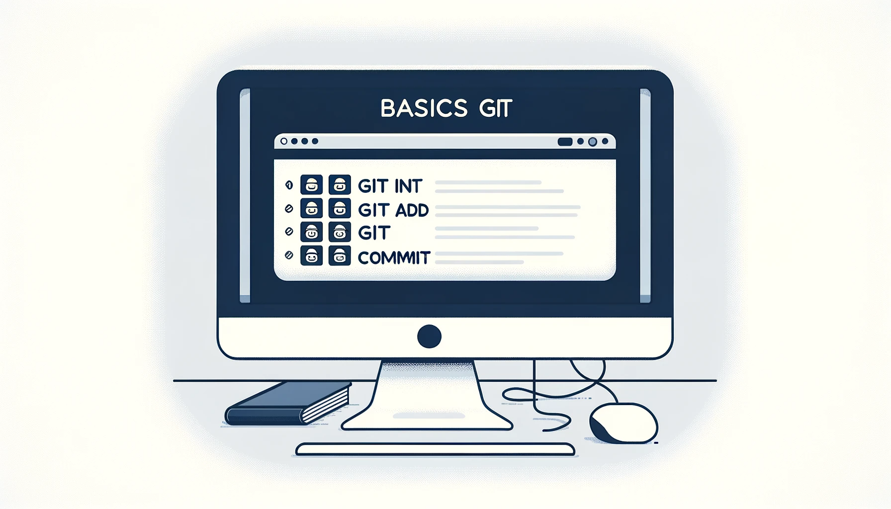

**Git** est un logiciel de **versioning** de code. Plus simplement, c'est un outil qui permet de suivre, gérer, historiser et partager les modifications d'un projet. Il est très utilisé dans le monde du développement logiciel car il intègre des fonctionnalités permettant aux développeurs de travailler en équipe sur un même projet.

## D'où vient **git** ?

**Git** a été créé par **Linus Torvalds** en 2005. Il a été créé pour gérer le développement du noyau Linux. Il est aujourd'hui utilisé par de nombreux projets open source et par de nombreuses entreprises.

## Les avantages de **git**

- **Historisation** : il est possible de voir l'historique des modifications et de revenir en arrière sur une modification.
- **Collaboration** : il est possible de travailler à plusieurs sur un même projet grâce aux **branches** et aux **pull requests**.
- **Sécurité** : il est possible de revenir en arrière sur une modification et de restaurer une version précédente du projet.
- **Portabilité** : il est possible de travailler sur un projet depuis n'importe quel ordinateur.
- **Flexibilité** : il est possible de travailler sur un projet depuis n'importe quel système d'exploitation.

## Les concepts de **git**

### Dépôt

Un **dépôt** représente un ensemble de fichiers et de dossiers qui forment un projet.  Il contient tous les **commits** et peut exister **localement** sur votre machine (dépôt local) ou en **ligne** (dépôt distant), comme sur GitHub ou GitLab, et même sur un serveur git local (tel que GitLab CE).

### Commit

Un **commit** représente une version du projet, une capture de son état à un instant donné. Il contient les modifications apportées au projet depuis le dernier commit. Il est identifié par un **hash** unique.

### Branches

Les **branches** sont un outil permettant de travailler sur **plusieurs versions** du projet en **parallèle**. Elles sont utilisées pour développer des fonctionnalités isolées les unes des autres ou pour séparer les développements de plusieurs développeurs.

La **branche principale** (souvent appelée *master* ou *main*) contient le code de production, tandis que les autres branches (branches de fonctionnalités) sont utilisées pour développer de nouvelles fonctionnalités.

**Remarque** : il est possible de créer des branches à partir de branches. Il est donc possible de créer des branches de branches de branches, etc.

**Remarque 2** : il est important de protéger la branche principale et de ne pas y faire de modifications directement. 

### Merge request

Une **merge request** (ou **pull request**) est une demande de validation de modifications.

Lorsqu'un développeur a codé une fonctionnalité sur une branche, il doit créer créer une **merge request** afin de pouvoir fusionner la branche actuelle avec une autre branche (généralement la branche principale). 

Une fois la **merge request** créée, un autre développeur doit la valider. Une fois la **merge request** validée, la branche est fusionnée avec la branche cible.

Dans un contexte professionnel, le code est souvent relu par un autre développeur avant d'être validé. Cela permet de s'assurer que le code est de bonne qualité et qu'il ne contient pas de bugs.

### Pull / Push

Les commandes **pull** et **push** permettent de récupérer les modifications depuis le dépôt distant et de les envoyer vers le dépôt distant.

### Fork et clone

Les commandes **fork** et **clone** permettent de récupérer le code d'un autre dépôt. Cependant il existe une différence entre les deux commandes.

Un **fork** effectue une copie complète du dépôt sur le compte de l'utilisateur (GitHub, GitLab, etc.). Ainsi, l'utilisateur peut modifier le code et créer des **merge requests** pour proposer ses modifications au dépôt d'origine. Cependant, le **fork** est un dépôt à part entière et il n'est pas synchronisé avec le dépôt d'origine.

Un **clone** effectue une copie du dépôt sur la machine de l'utilisateur. Ainsi, l'utilisateur peut modifier le code et envoyer ses modifications vers le dépôt distant. Ici, le dépôt est synchronisé avec le dépôt d'origine mais il faut avoir les droits pour pouvoir envoyer ses modifications vers le dépôt original.

### Le fichier `.gitignore`

Le fichier `.gitignore` permet d'ignorer certains fichiers ou dossiers. Il est utile pour ne pas versionner les fichiers de configuration, les fichiers de logs, les fichiers de cache, etc.

Il est très important de bien configurer le fichier `.gitignore` afin de ne pas versionner des fichiers inutiles, et surtout de ne pas versionner des fichiers sensibles (mots de passe, clés d'API, etc.).

Pour aller plus loin, [ce dépôt](https://github.com/github/gitignore) contient une série de fichiers `.gitignore` pour différents langages et frameworks.

## Installation

### Windows

Il est possible d'installer **git** sur Windows en téléchargeant le fichier d'installation sur le site officiel : [Git - Downloading Package](https://git-scm.com/download/win).

### Linux

Sur **Linux**, l'installation de **git** dépend de la distribution utilisée et de son gestionnaire de paquets.

#### Debian

```bash
sudo apt install git
```

#### Arch Linux

```bash
sudo pacman -S git
```

#### CentOS

```bash
sudo yum install git
```

## Configuration

Il faut configurer **git** avec son nom d'utilisateur et son adresse email.

```bash
git config --global user.name "John Doe"
git config --global user.email "john.doe@test.com"
git config --global core.editor "vim"
```

Il est possible de vérifier la configuration avec la commande suivante :

```bash
git config --list
```

De nombreuses autres configurations sont possibles. Pour plus d'informations, [cliquez ici](https://git-scm.com/book/en/v2/Customizing-Git-Git-Configuration).

#### Ressources

- [Git - Documentation](https://git-scm.com/doc)
- [Learn the Basics of Git in Under 10 Minutes - freeCodeCamp](https://www.freecodecamp.org/news/learn-the-basics-of-git-in-under-10-minutes-da548267cc91/)
- [Git and GitHub for Beginners - freeCodeCamp](https://www.youtube.com/watch?v=RGOj5yH7evk)
- [Git for Professionals Tutorial - freeCodeCamp](https://www.youtube.com/watch?v=Uszj_k0DGsg)
- [Gérez du code avec Git et GitHub - OpenClassRooms](https://openclassrooms.com/fr/courses/7162856-gerez-du-code-avec-git-et-github)
- [Tuto GIT Guide Complet Pour une Prise en Main Rapide ! - Hostinger](https://www.hostinger.fr/tutoriels/tuto-git)
- [.gitignore File – How to Ignore Files and Folders in Git](https://www.freecodecamp.org/news/gitignore-file-how-to-ignore-files-and-folders-in-git/)
- [git config – How to Configure Git Settings to Improve Your Development Workflow](https://www.freecodecamp.org/news/git-config-how-to-configure-git-settings/)