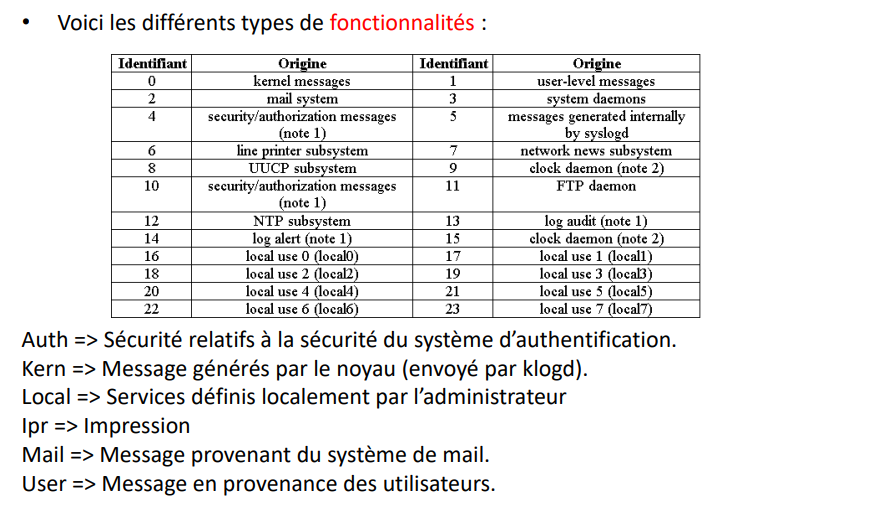

La **supervision** consiste à surveiller l'état d'un système informatique et à alerter en cas de dysfonctionnement. Elle permet de détecter les problèmes et de les résoudre rapidement avant qu'ils n'aient un impact sur les utilisateurs.

Ces notes sont tirées du cours de supervision réseau dispensé à l'école d'ingénieurs **ESIEE Amiens** dans la spécialité **Réseaux informatiques**.

**Pourquoi superviser ?**

- Détecter les problèmes avant qu'ils n'aient un impact sur les utilisateurs
- Faciliter l'administration du réseau (entretien, surveillance, dépannage)
- Améliorer la qualité de service (QoS)
- Assurer la sécurité du réseau (détection d'intrusion, etc.)

## Les protocoles de supervision réseau

### SNMP (Simple Network Management Protocol)

`SNMP` est un protocole de supervision réseau qui permet de **superviser des équipements réseau et informatiques** (routeurs, commutateurs, imprimantes, etc.). Il est **utilisé pour récupérer des informations sur l'état des équipements et pour les configurer à distance**.
Il a été normalisé par l'`IETF` (Internet Engineering Task Force) dans la **RFC 1157** en **1988**. C'est un standard pour l'administration des réseaux. La version actuelle est la `SNMPv3` (1999).

**Objectif :** communiquer, échanger des données et gérer les équipements de façon automatique et transparente.

Quelques informations sur `SNMP` :

- Protocole de la `couche application` (couche 7)
- Utilise le protocole de transport `UDP` : 
  - Port `161` pour envoyer des requêtes (côté client)
  - Port `162` pour recevoir des réponses (côté serveur).
- Il utilise le concept de `client-serveur` :
  - `Client` : équipements réseau à superviser ou `agents`
  - `Serveur` : équipement hébergeant la solution de supervision ou `manager`

**Avantages :**

- **Simple** : mise en place rapide et peu chère
- **Stable** : repose sur le principe du paradigme « aller chercher – enregistrer »
- **Souple** : on installe uniquement les commandes qui seront adaptées au réseau
- **Performant** : rapide et de petite taille
- **Disponible** : répandu sur le marché (incontournable pour les constructeurs)

#### Les versions de SNMP

##### SNMPv1 (1988)

C'est la version initiale du protocole qui a permis de :

- Fournir un **standard accepté par l'ensemble des constructeurs**
- Développer un **grand choix de logiciels de supervision**

Ses **points faibles** :

- **Manque de sécurité** : les `communautés` sont envoyées en clair sur le réseau.
- **Protocole inefficace** : pas de transfert d'informations en masse des variables de la `MIB` (Management Information Base).
- **Pas de contrôle d'accès** : pas de contrôle d'accès en lecture et en écriture sur les objets de la `MIB`.

##### SNMPv2 (1993)

`SNMPv2` apporte des **améliorations** :

- Une **entité SNMP** peut être à la fois un `manager` et un `agent`.
- **Primitive `Inform`** : dialogue de manager à manager.
- **Primitive `GetBulk`** : permet au `manager` de demander en bloc plusieurs variables consécutives dans la `MIB` de l'agent.

##### SNMPv3 (1999)

`SNMPv3` apporte des **améliorations** pour la sécurité :

- **Authentification** : garantit l'authenticité de l'émetteur et du récepteur en **se basant sur `MD5` ou `SHA` afin de crypter les données d'authentification**.
- **Chiffrement** : réalisé par `DES` (Data Encryption Standard) **afin d'empêcher la lecture des données contenues dans les paquets `SNMP`** en cas d'interception par un tiers.
- **Estempillage du temps**: mécanisme anti-rejeu qui permet de **vérifier que le paquet n'a pas déjà été transmis**. Pour cela, la **date d'émission du paquet est comparée à la date de réception**. Si la différence est **supérieure à 150 secondes**, le paquet est **rejeté**.

#### La notion de MIB

La `MIB` est une **base de données** gérée par un `agent` et qui **contient des informations sur celui-ci** : nom, version, constructeur, etc. 

Ces informations sont contenues dans des `objets` qui sont eux-mêmes organisés en `groupes`.

Une `MIB` a donc une structure en **arbre** dans laquelle chaque `objet`` est identifié par un `OID` (Object IDentifier). Cette structure les règles `SMI` (Structure of Management Information). 

Le chemin vers un objet est ainsi représenté par une **suite de nombres séparés par des points** de manière absolue : `1.3.6.1.2.1.2.2.1.2` (nom de l'interface réseau).

**Aperçu :**


**Les MIB les plus utilisées sont :**

- `System` : description de l'equipement
- `Interfaces` : description des interfaces réseau
- `Dot1dBridge` : equipements de routage (port STP, port forwarding, routage...)
- `Host` : description des hôtes (OS, CPU, RAM, disques, etc.)

**Où trouver les `MIB` ?**

- Sur le site du constructeur
- Sur des sites spécialisés comme [OIDview](http://www.oidview.com/mibs/detail.html) ou [plixer](https://www.plixer.com/support/netflow-configuration/cisco-snmp-mibs/)
- En utilisant des logiciels comme [MIB Browser](https://www.ireasoning.com/mibbrowser.shtml) ou [SNMPutil](https://www.snmpsoft.com/freetools/snmpwalk.html)

#### La notion de communauté

Une `communauté` correspond à un groupe composé d'`agents` et de `managers` à qui on a configuré la même `chaîne de caractères de communauté` (un mot de passe en quelque sorte). **Seuls les périhpériques possédant la même `communauté` peuvent échanger des messages `SNMP`**. Un périphérique peut être membre de plusieurs `communautés`.

**Principe de l'authentification :** le `manager` envoie une requête `SNMP` à un `agent` en précisant la `communauté` dans le message afin d'assurer l'authenticité de la communication.

**Politique d'accès :** les communautés permettent un **contrôle d'accès en lecture et en écriture** sur les objets de la MIB (RO, RW, etc.).

#### Résumé des fonctionnalités et niveaux de sécurité par version de SNMP

##### Niveau de sécurité

| Version | Level | Authentification | Chiffrement | Processus d'authentification |
|---------|--------------|------------------|-------------|---------------------------|
| SNMPv1  | NoAuthNoPriv | Community String | Non         | Comparaison de la chaîne de caractères de la communauté |
| SNMPv2c | NoAuthNoPriv | Community String | Non         | Comparaison de la chaîne de caractères de la communauté |
| SNMPv3  | NoAuthNoPriv | Username         | Non         | Comparaison du nom d'utilisateur |
| SNMPv3  | AuthNoPriv   | MD5 ou SHA       | Non         | Authentification basée sur HMAC-MD5 ou HMAC-SHA |
| SNMPv3  | AuthPriv     | MD5 ou SHA       | DES         | Authentification basée sur HMAC-MD5 ou HMAC-SHA et chiffrement basé sur DES (56 bits) |

##### Fonctionnalités

| Fonctionnalité | SNMPv1 | SNMPv2c | SNMPv3 |
|----------------|--------|---------|--------|
| Get            | Oui    | Oui     | Oui    |
| GetNext        | Oui    | Oui     | Oui    |
| Set            | Oui    | Oui     | Oui    |
| GetBulk        | Non    | Oui     | Oui    |
| Trap           | Oui    | Oui     | Oui    |
| Inform         | Non    | Oui     | Oui    |
| Community String | Oui | Oui   | Non    |
| Username based security | Non | Non | Oui |
| Authentification par message | Non | Non | Oui |
| Chiffrement des messages | Non | Non | Oui |

#### Quelques exemples de logiciels de supervision SNMP

- PRTG
- Zabbix
- Nagios
- Observium
- Icinga 2

#### Structure d'un message SNMP

Une trame `SNMP` se présente comme suit :


- **Version** : le manager et l'agent doivent utiliser la même version.
- **Communauté** : chaîne de caractères qui permet l'authentification et le contrôle d'accès.
- **Type de PDU** :
  - GetRequest : valeur du champ à 0
  - GetNextRequest : valeur du champ à 1
  - GetResponse : valeur du champ à 2
  - SetRequest : valeur du champ à 3
- **ID de requête** : champ servant à coordonner la requête du manager et la réponse de l'agent.
- **Index d'erreur** : identifie les entrées avec la liste des variables qui ont causé l'erreur.
- **Obj/Val** : liste des objets et des valeurs associées.

#### Trap SNMP

Un `trap SNMP` est un message envoyé par un `agent` à un `manager` pour l'informer d'un événement. Il est envoyé de façon asynchrone (pas de requête préalable du manager) sur le port `162` en `UDP`. 

Afin qu'ils soient déclenchés, **les `traps SNMP` doivent être configurés** : défaut de câble réseau, disque dur défaillant, problème d'aliementation, etc.

**Exemple de trap SNMP :**

- **Link Down** ou **Link Up** : interface réseau passe en état `down` ou `up`
- **Cold Start** ou **Warm Start** : type de redémarrage de l'équipement
- **Authentication Failure** : tentative d'accès à un équipement a échoué
- **Loss of BGP** : la connexion d'un équipement à son voisin BGP est perdue

Un paquet `Trap SNMP` se présente comme suit :


- **Communauté** : sert à l'authentification et au contrôle d'accès.
- **Type de PDU** : valeur du champ à 4 pour un trap SNMP.
- **Entreprise ID** : identifie l'entreprise qui a défini le trap.
- **Agent Address** : adresse IP de l'agent SNMP.
- **Type générique** : identifie le type de trap (7 types possibles).
- **Type spécifique** : identifie des trap spécifiques à une entreprise.
- **Time Stamp** : date et heure de l'événement.
- **Obj/Val** : liste des objets et des valeurs associées.

#### Mise en place du SNMP

##### Configuration d'un agent SNMP Windows

Sur **Windows**, il faut paramétrer le service `SNMP` dans les `Services Windows` :


##### Configuration d'un agent SNMP Linux

Sur **Linux**, il faut installer le paquet `snmpd` :

```bash
sudo apt-get install snmpd
```

On peut ensuite configurer le service `SNMP` dans le fichier `/etc/snmp/snmpd.conf` (communauté, trap, etc.).

##### Configuration d'un agent SNMP Cisco

Sur **Cisco**, on peut activer le service `SNMP` en version `2c` avec la communauté `public` :

```bash
conf t
snmp-server community public RO
```

Il faut ensuite configurer le `serveur SNMP` :

```bash
snmp-server host <IP> <communauté>
```

Pour activer les traps `SNMP` :

```bash
conf t
snmp-server enable traps <type>
```

Exemples de types de traps :

```bash
snmp-server enable traps tty
snmp-server enable traps config
snmp-server enable traps vtp
```

##### Commandes utiles (sous Linux)

###### SNMPGet

La commande `snmpget` permet d'obtenir une information sur un objet de la `MIB` d'un agent SNMP.

En `SNMPv1` et `SNMPv2c`, la commande est la suivante :

```bash
snmpget -v 2c -c <community> <ip de l'agent> .1.3.6.1.2.1.1.3.0
```

En `SNMPv3`, la commande est assez complexe puisqu'il faut préciser les paramètres d'authentification et de chiffrement :

```bash
snmpget -v3 -l auth -u giollaume -a sha -A giollaume -x AES -X giollaume 10.6.0.253 1.3.6.1.2.1.2.2.1.1.10024
```

Dans cette commande, on précise différents paramètres :

- `-v3` : version `SNMPv3`
- `-l auth` : précise la nécessité d'une authentification
- `-u giollaume` : nom d'utilisateur
- `-a sha` : algorithme d'authentification
- `-A giollaume` : mot de passe d'authentification
- `-x AES` : algorithme de chiffrement des données
- `-X giollaume` : mot de passe de chiffrement des données
- `IP de l'agent`
- `OID` : identifiant de l'objet à récupérer

###### SNMPTranslate

La commande `snmptranslate` permet de traduire un `OID` en nom d'objet :

```bash
snmptranslate -On .1.3.6.1.2.1.1.3.0
```

###### SNMPWalk

La commande `snmpwalk` permet de récupérer la valeur de tous les objets de la `MIB` :

```bash
snmpwalk
```

###### SNMP Bulk Walk

La commande `snmpbulkwalk` permet de récupérer la valeur de tous les objets de la `MIB` en une seule requête :

```bash
snmpbulkwalk
```

Elle n'est pas disponible en `SNMPv1` puisqu'elle a été introduite en `SNMPv2c` pour améliorer les performances du protocole. 

### Syslog

`Syslog` est un protocole de supervision provenant du monde `Linux`, mais permettant également de superviser des équipements réseau.

**Fonctionnalités :**

- Centralisation des journaux d'événements
- Transport des messages de journalisation sur le réseau vers un **serveur** (`rsyslog` ou `syslog-ng`)
- Décharge les programmeurs de la gestion des journaux d'événements. Par exemple sous `linux` les logs des applications sont stockés dans `/var/log/` de manière systématique.
- Permet à l'administrateur de gérer l'ensemble des logs avec un fichier unique.
- Permet de gérer les entrées de journaux en fonction de leur type et de leur niveau d'urgence

**Quelques caractéristiques :**

- `Syslog` est un protocole de la `couche application` qui utilise le protocole de transport `UDP` (port `514`).
- Utilise une architecture `client-serveur`
- `Syslogd` est le démon qui gère les messages de journalisation
- `Syslog` est souvent utilisé pour centraliser tous les journaux d'un parc informatique.
- `ntsyslog` est l'implémentation de `Syslog` sous `Windows`
- Avec `syslogd -r` on peut gérer les logs d'hôtes distants

#### Format des messages Syslog

**Un journal comporte les informations suivantes dans l'ordre :**

- **Date** à laquelle l'événement s'est produit
- **Nom de l'hôte** sur lequel l'événement s'est produit
- **Information sur le processus** qui a généré l'événement
- **Gravité** de l'événement
- **Identifiant** du processus
- **Message** décrivant l'événement

Certaines de ces informations sont optionnelles et peuvent être omises.

**Comment connaître la priorité d'un événement ?**

Il faut d'abord identifier la valeur liée à la `fonctionnalité` de l'événement :



Ensuite, il faut identifier la valeur liée à la `gravité` de l'événement :


Pour trouver la `priorité` de l'événement, il suffit d'appliquer la formule suivante : 

```matlab
Priorité = (Fonctionnalité * 8) + Gravité
```

**A noter** : une priorité importante ne signifie pas que le message sera traité ou acheminé plus rapidement qu'un autre.

#### Sécurité

`Syslog` ne permet pas de sécuriser les messages de journalisation :

- Pas d'authentification
- Pas de chiffrement
- Facile à abuser ou inonder de faux messages
- Informations circulent en clair sur le réseau
- Risque de déni de service
- Risque de spoofing (usurpation de l'adresse IP d'un hôte)
- Pas d'accusé de réception des messages car utilisation de `UDP` (pas en mode connecté)

#### Gestion des journaux

Les journaux sont des fichiers dans lesquels les informations s'accumulent et ils peuvent devenir très volumineux.

**Contraintes :**

- **Taille** : supprimer les informations les plus anciennes quand le fichier atteint une certaine taille.
- **Temps** : ne garder les informations un temps minimal pour permettre de faire des analyses.

**Quelques idées pour gérer les journaux :**

- Suppression des entrées à intervalles réguliers
- Alerte si le fichier dépasse d'un coup une certaine taille (peut être un signe de déni de service)
- Utiliser des outils comme `logrotate` ou `newsyslog` pour gérer la rotation des journaux

#### Quelques exemples de logiciels de supervision Syslog

- Graylog
- Splunk
- ELK Stack

### NetFlow

`NetFlow` est un protocole de supervision réseau qui permet de collecter des informations sur le trafic réseau. Il a été développé par `Cisco` en **1996**.

**Caractéristiques :**

- Protocole de **niveau 3** (couche `réseau`)
- Standardisé depuis la **version 9** : `IPFIX` (Internet Protocol Flow Information Export)
- **Chaque constructeur a sa propre implémentation** (Cisco, Juniper, etc.) :

  - `JFlow` pour Juniper
  - `AppFlow` pour Citrix
  - `NetStream` pour HP

**Le concept majeur de `NetFlow` est la notion de `flux` :** un flux est un ensemble de paquets qui partagent les mêmes caractéristiques (adresse IP source, adresse IP destination, port source, port destination, protocole, interface d'entrée, interface de sortie, etc.).

**Intérêt :** permet de voir les évolutions des flux et adapter la `QoS` en fonction des besoins.

`Netflow` permet :

- **Surveiller en temps réel l'utilisation de la bande passante** par les applications et les utilisateurs
- Comprendre par qui, quand, et où est utilisé le réseau
- Mesurer l’efficacité du réseau et des ressources
- Appréhender l'impact des changements sur le réseau
- Détecter les anomalies et les vulnérabilités de sécurité de réseau
- Auditer la conformité et les processus business
- Aider au **troubleshooting** (dépannage) : identifier pourquoi un serveur est lent, pourquoi une application ne fonctionne pas, etc.
- Analyse des impacts de nouvelles applications sur le réseau
- Anticiper les besoins en bande passante pour de nouvelles applications : VoIP, vidéo, etc.
- Facturer des clients ou des services internes en fonction de l'utilisation du réseau

**Illustration du fonctionnement de `NetFlow` :**


**A savoir** : Pour fonctionner, `Netflow` a besoin d'accéder au contenu des paquets. Il est donc incompatible avec le chiffrement des données (VPN, SSH, IPSec, etc.).

**Netflos vs SFlow :**

- SFlow réalise un échantillonnage des paquets alors que NetFlow analyse tous les paquets.
- SFlow consomme moins de CPU et moins de bande passante que NetFlow.
- Mais NetFlow est plus précis que SFlow.

**Quand utilise l'un ou l'autre ?**

- **SFlow :** pour avoir une vue générale sur le trafic réseau
- **NetFlow :** pour avoir une vue détaillée sur le trafic réseau

Quelques exemples de sondes `NetFlow` :

- Ntop (open source) : agent logiciel
- Nprobe (open source) : agent logiciel
- WhatsUp Flow Publisher : agent logiciel
- Flowmon : agent matériel
- PRTG Traffic Grapher

**A savoir :** il existe des `agents logiciels` et des `agents matériels` pour `NetFlow`. Les agents logiciels sont moins performants que les agents matériels.

## Notions de SLA et IP SLA

Un `SLA` (Service Level Agreement) est un **document** qui définit la **qualité de service** requise entre un prestataire et un client. 

Le terme est également utilisé en référence aux modalités et/ou à la performance du service telles que définies dans le contrat.

**Exemple :** un SLA peut définir le temps de réponse maximum d'un serveur web, le temps de résolution d'un ticket, etc.

## Termes associés

### Latence (Latency)

La `latence` est le temps écoulé entre le moment où une information est émise et le moment où elle est reçue. Elle est exprimée en millisecondes (ms).

**Exemples :** temps de réponse d'un serveur, temps de réponse d'un ping, temps de réponse entre une requête et une réponse, etc.

### Gigue (Jitter)

La `gigue` est la variation de la latence. Elle est exprimée en millisecondes (ms). Cette notion est importante dans la `VoIP` car elle peut provoquer des coupures de son ou des décalages puisque le `datarate` doit être constant pour garantir la fluidité de la communication.

### MOS (Mean Opinion Score)

Le `MOS` est une note (entre 1 et 5) donnée à un codec audio pour caractériser la qualité de la voix.

## Intérêt et enjeux

L'intérêt est d'éviter les **coupures** et les **interruptions** de service, mais également de garantir une **qualité minimale de service**.

## Utiliser les IP SLA pour superviser un réseau et garantir le respect des SLA

On peut utiliser différents types de SLA pour superviser un réseau :

- `UDP Echo`
- `TCP Connect`
- `HTTP`

En configurant des `IP SLA` sur les équipements réseau, on va pouvoir **vérifier si les objectifs contractuels sont atteints**. Si ce n'est pas le cas, **on pourra déclencher une alerte afin de notifier les administrateurs de la dégradation de la qualité de service**. Ces tests peuvent être réalisés de façon régulière (toutes les 5 minutes par exemple) et consistent en l'envoi de **paquets de tests**, en utilisant différents protocoles (UDP, TCP, HTTP, etc.), vers des équipements distants (souvent les équipements faisant l'objet du contrat de service).
