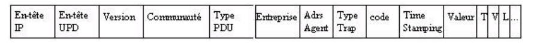

# Les protocoles de supervision réseau

La **supervision** est une activité qui consiste à surveiller l'état d'un système informatique et à alerter en cas de dysfonctionnement. Elle permet de détecter les problèmes et de les résoudre rapidement avant qu'ils n'aient un impact sur les utilisateurs. 

Ces notes sont tirées du cours de supervision réseau dispensé à l'école d'ingénieurs **ESIEE Amiens** dans la spécialité **Réseaux informatiques**.

**Pourquoi superviser ?**

- Pour détecter les problèmes avant qu'ils n'aient un impact sur les utilisateurs
- Pour faciliter l'administration du réseau (entretien, surveillance, dépannage)
- Pour améliorer la qualité de service (QoS)
- Pour améliorer la sécurité du réseau

## SNMP

`SNMP` (Simple Network Management Protocol) est un protocole de supervision réseau qui permet de superviser des équipements réseau (routeurs, commutateurs, imprimantes, etc.). Il est utilisé pour récupérer des informations sur l'état des équipements et pour les configurer à distance. Il a été normalisé par l'`IETF` (Internet Engineering Task Force) dans la **RFC 1157** en **1988**. C'est désormais un standard pour l'administration des réseaux. La version actuelle est la `SNMPv3` (1999).

**Objectif :** communiquer, échanger des données et gérer les équipements de façon automatique et transparente. 

`SNMP` est un protocole de la `couche application`. Il utilise le concept de `client-serveur` : les **clients** sont les équipements supervisés (ordinateurs, routeurs, etc.) et le **serveur** est la station d'administration de la solution de supervision.

`SNMP` utilise le protocole de transport `UDP` (User Datagram Protocol) pour envoyer des messages de supervision. Il utilise le port `161` pour envoyer des requêtes (côté client) et le port `162` pour recevoir des réponses (côté serveur).

Avantages :
- Simple : mise en place rapide et peu chère
- Stable : repose sur le principe du paradigme « aller chercher – enregistrer »
- Souple : on installe uniquement les commandes qui seront adaptées au réseau
- Performant : rapide et de petite taille
- Disponible : répandu sur le marché (incontournable pour les constructeurs)

### Les versions de SNMP

#### SNMPv1 (1988)

Il s'agit de la version initiale du protocole qui a permis de fournir un **standard accepté par l'ensemble des constructeurs** et qui a permis de **développer un grand choix d'outils de supervision**.

La version 1 comportait des **points faibles** :
- Manque de sécurité : les **communautés** (chaînes de caractères) sont envoyées en clair sur le réseau.
- Protocole inefficace : pas de transfert d'informations en masse.
- Pas de limitation sélectives d'accès à la `MIB` de l'agent (l'agent est l'équipement supervisé).

#### SNMPv2 (1993)

`SNMPv2` apporte des **améliorations** :
- Une entité SNMP peut être à la fois un **agent** et un **manager**.
- **Primitive Inform** : dialogue de manager à manager.
- **Primitive GetBulk** : permet à une plateforme de gestion de demander en bloc plusieurs variables consécutives dans la MIB de l'agent.
- **Mécanismes de sécurité** : confidentialité des messages par cryptographie (DES) et support multiprotocole (UDP, OSI, etc.).

#### SNMPv3 (1999)

`SNMPv3` apporte des **améliorations** pour la sécurité :
- **Authentification** : garantit l'authenticité de l'émetteur et du récepteur en se basant sur `MD5` ou `SHA` afin de crypter les données d'authentification.
- **Chiffrement** : réalisé par `DES` (Data Encryption Standard), il empêche la lecture des données contenues dans les paquets `SNMP` en cas d'interception par un tiers.
- **Estempillage du temps**: empêche la réutilisation d'un paquet SNMPv3 valide déjà transmis par un tiers pour éviter les attaques de type « rejeu ». Chaque paquet `SNMPv3` est estampillé avec une date qui est comparée à la réception avec le temps local de l'agent. Si la différence est **supérieure à 150 secondes**, le paquet est rejeté.

### La notion de MIB

La `MIB` (Management Information Base) est une base de données gérée par un agent SNMP regroupantr les objets gérés en respectant les règles `SMI` (Structure of Management Information). La `SMI` est la définition de la structure de la MIB,ce la montre comment les objets sont connectés ensemble afin de former un arbre hiérarchique. La structure peut être semblable à celle d'un système de fichiers ou d'un DNS. On retrouve une racine non-nommée à partir de laquelle on référence de façon absolue un objet par son OID (Noeud de l'arbre).

Afin d'être organisées, les variables des `MIB` sont regroupées en **groupes**. Chaque groupe est identifié par un `OID` et contient des **objets**. Chaque objet est identifié par un `OID` et contient des **instances**. Chaque instance est identifiée par un `OID` et contient des **valeurs**.

**Pour résumer** : la `MIB` est une base de données qui contient des informations sur les équipements réseau. Elle est organisée sous forme d'arbre et chaque objet est identifié par un `OID` (Object IDentifier).

**Aperçu :**


Les `MIB` les plus utilisées sont :
- `System` : description de l'equipement
- `Interfaces` : description des interfaces réseau
- `Dot1dBridge` : equipements de routage (port STP, port forwarding, routage...)
- `Host` : description des hôtes (OS, CPU, RAM, disques, etc.)

**Où trouver les `MIB` ?**

- Sur le site du constructeur
- Sur des sites spécialisés comme [OIDview](http://www.oidview.com/mibs/detail.html) ou [plixer](https://www.plixer.com/support/netflow-configuration/cisco-snmp-mibs/)
- En utilisant des logiciels comme [MIB Browser](https://www.ireasoning.com/mibbrowser.shtml) ou [SNMPutil](https://www.snmpsoft.com/freetools/snmpwalk.html)

### La notion de communauté

Une `communauté SNMP` se définit comme une relation entre un agent SNMP et un ensemble de stations d'administration. Elle est définie par une chaîne de caractères appelée `communauté` (ou `community string`) qui permet une `authentification` et un `contrôle d'accès`. 

**Principe de l'authentification :** la station de gestion envoie avec le message un mot de passe correspondant à la communauté afin de permettre au récepter de vérifier l'authenticité de l'émetteur.
**Politique d'accès :** les communautés permettent un contrôle d'accès en lecture et en écriture sur les objets de la MIB. On met la communauté "public" pour les équipoements accessibles par toutes les stations de gestion et la communauté "private" pour celle dont l'accès doit être restreint.

### Résumé des fonctionnalités et niveaux de sécurité par version de SNMP

#### Niveau de sécurité

| Version | Level | Authentification | Chiffrement | Processus d'authentification |
|---------|--------------|------------------|-------------|---------------------------|
| SNMPv1  | NoAuthNoPriv | Community String | Non         | Comparaison de la chaîne de caractères de la communauté |
| SNMPv2c | NoAuthNoPriv | Community String | Non         | Comparaison de la chaîne de caractères de la communauté |
| SNMPv3  | NoAuthNoPriv | Username         | Non         | Comparaison du nom d'utilisateur |
| SNMPv3  | AuthNoPriv   | MD5 ou SHA       | Non         | Authentification basée sur HMAC-MD5 ou HMAC-SHA |
| SNMPv3  | AuthPriv     | MD5 ou SHA       | DES         | Authentification basée sur HMAC-MD5 ou HMAC-SHA et chiffrement basé sur DES (56 bits) |

#### Fonctionnalités

| Fonctionnalité | SNMPv1 | SNMPv2c | SNMPv3 |
|----------------|--------|---------|--------|
| Get            | Oui    | Oui     | Oui    |
| GetNext        | Oui    | Oui     | Oui    |
| Set            | Oui    | Oui     | Oui    |
| GetBulk        | Non    | Oui     | Oui    |
| Trap           | Oui    | Oui     | Oui    |
| Inform         | Non    | Oui     | Oui    |
| Community String | Oui | Oui   | Non    |
| Username based security | Non | Non | Oui |
| Authentification par message | Non | Non | Oui |
| Chiffrement des messages | Non | Non | Oui |

### Quelques exemples de logiciels de supervision SNMP

- PRTG
- Zabbix
- Nagios
- Observium

### Structure d'un message SNMP

Une trame `SNMP` se présente comme suit :


- **Version** : le manager et l'agent doivent utiliser la même version.
- **Communauté** : chaîne de caractères qui permet l'authentification et le contrôle d'accès.
- **Type de PDU** : 
  - GetRequest : valeur du champ à 0
  - GetNextRequest : valeur du champ à 1
  - GetResponse : valeur du champ à 2
  - SetRequest : valeur du champ à 3
- **ID de requête** : champ servant à coordonner la requête du manager et la réponse de l'agent.
- **Index d'erreur** : identifie les entrées avec la liste des variables qui ont causé l'erreur.
- **Obj/Val** : liste des objets et des valeurs associées.

### Trap SNMP

Le `trap SNMP` est un message envoyé par un agent SNMP à un manager SNMP pour l'informer d'un événement. Il est envoyé de façon asynchrone, c'est-à-dire qu'il n'y a pas de requête préalable du manager. Il est envoyé sur le port `162` en `UDP`. On peut configurer des événements afin qu'ils soient signalés par un `trap SNMP` lors de leur déclenchement : défaut de câble réseau, disque dur défaillant, problème d'aliementation, etc.

**Exemple de trap SNMP :**
- **Link Down** ou **Link Up** : événement qui se produit lorsqu'une interface réseau passe en état `down` ou `up`.
- **Cold Start** ou **Warm Start** : événement qui se produit selon le type de redémarrage de l'équipement.
- **Authentication Failure** : événement qui se produit lorsqu'une tentative d'accès à l'équipement a échoué.
- **Loss of BGP** : événement qui se produit lorsque la connexion d'un équipement à son voisin BGP est perdue.

Un paquet `Trap SNMP` se présente comme suit :



- **Communauté** : sert à l'authentification et au contrôle d'accès.
- **Type de PDU** : valeur du champ à 4 pour un trap SNMP.
- **Entreprise ID** : identifie l'entreprise qui a défini le trap.
- **Agent Address** : adresse IP de l'agent SNMP.
- **Generic Trap** : identifie le type de trap (7 types possibles).
- **Specific Trap** : identifie des trap spécifiques à une entreprise.
- **Time Stamp** : date et heure de l'événement.
- **Obj/Val** : liste des objets et des valeurs associées.

### Mise en place du SNMP

#### Configuration d'un agent SNMP Windows

Sur **Windows**, il faut paramétrer le service `SNMP` dans les `Services Windows` :


#### Configuration d'un agent SNMP Linux

Sur **Linux**, il faut installer le paquet `snmpd` :

```bash
sudo apt-get install snmpd
```

On peut ensuite configurer le service `SNMP` dans le fichier `/etc/snmp/snmpd.conf` (communauté, trap, etc.). 

#### Configuration d'un agent SNMP Cisco

Sur **Cisco**, on peut activer le service `SNMP` en version 2c avec la communauté `public` :

```bash
conf t
snmp-server community public RO
```

Pour activer les traps `SNMP` :

```bash
conf t
snmp-server enable traps <type> <option>
```

#### Commandes utiles

##### SNMPGet

La commande `snmpget` permet d'obtenir une information sur un objet de la `MIB` d'un agent SNMP :

```bash
snmpget -v 2c -c test localhost .1.3.6.1.2.1.1.3.0
```

Dans cet exemple, on récupère la valeur de l'objet correspondant à l'`OID`.

##### SNMPTranslate

La commande `snmptranslate` permet de traduire un `OID` en nom d'objet :

```bash
snmptranslate -On .1.3.6.1.2.1.1.3.0
```

## Syslog

`Syslog` est un protocole de supervision provenant du monde `Linux`, mais permettant également de superviser des équipements réseau. 

**Fonctionnalités :**
- Centralisation des journaux d'événements
- Transport des messages de journalisation sur le réseau vers un **serveur** tel que `rsyslog` ou `syslog-ng`
- Décharge les programmeurs de la gestion des journaux d'événements. Par exemple sous `linux` les logs des applications sont stockés dans `/var/log/` de manière systématique.
- Permet à l'administrateur de gérer l'ensemble des logs avec un fichier unique.
- Permet de gérer les entrées de journaux en fonction de leur type et de leur niveau d'urgence

**Quelques caractéristiques :**
- `Syslog` est un protocole de la `couche application` qui utilise le protocole de transport `UDP` (port `514`).
- Utilise une architecture `client-serveur`
- `Syslogd` est le démon qui gère les messages de journalisation
- `Syslog` est souvent utilisé pour centraliser tous les journaux d'un parc informatique.
- `ntsyslog` est l'implémentation de `Syslog` sous `Windows`
- Avec `syslogd -r` on peut gérer les logs d'hôtes distants

### Format des messages Syslog

**Un journal comporte les informations suivantes dans l'ordre :**
- **Date** à laquelle l'événement s'est produit
- **Nom de l'hôte** sur lequel l'événement s'est produit
- **Information sur le processus** qui a généré l'événement
- **Gravité** de l'événement
- **Identifiant** de l'événement
- **Message** décrivant l'événement

Certaines de ces informations sont optionnelles et peuvent être omises.

**Comment connaître la priorité d'un événement ?**

Elle est définie par sa fonctionnalité ainsi que sa gravité : il faut multiplier par 8 la fonctionnalité et ajouter la gravité. Par exemple, un événement de type `authpriv.notice` a une priorité de `10` (8 * 1 + 2).

**A noter** : une priorité importante ne signifie pas que l'événement sera traité ou acheminé plus rapidement qu'un autre. 

### Sécurité

`Syslog` ne permet pas de sécuriser les messages de journalisation : 
- Pas d'authentification
- Pas de chiffrement
- Facile à abuser ou inonder de faux messages
- Informations circulent en clair sur le réseau
- Risque de déni de service
- Risque de spoofing (usurpation de l'adresse IP d'un hôte)
- Pas d'accusé de réception des messages car utilisation de `UDP` (pas en mode connecté)

### Gestion des journaux

Les journaux sont des fichiers dans lesquels les informations s'accumulent et ils peuvent devenir très volumineux. 

**Contraintes et solutions :**
- **Taille** : supprimer les informations les plus anciennes quand le fichier atteint une certaine taille.
- **Temps** : conserver les informations un temps minimal pour permettre de faire des analyses.

**Quelques idées pour gérer les journaux :**
- Suppression des entrées à intervalles réguliers
- Alerte si le fichier dépasse d'un coup une certaine taille (peut être un signe de déni de service)
- Utiliser des outils comme `logrotate` ou `newsyslog` pour gérer la rotation des journaux

### Quelques exemples de logiciels de supervision Syslog

- Graylog
- Splunk
- ELK Stack