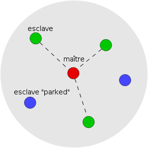
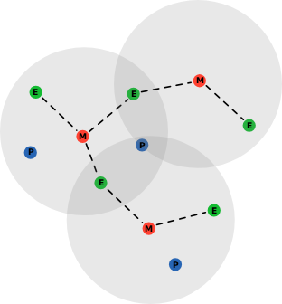
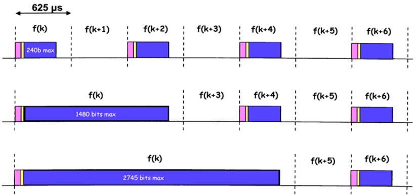

Bluetooth est une technologie de communication sans fil qui permet à des dispositifs électroniques de communiquer entre eux à courte distance. Elle utilise des ondes radio pour transférer des données entre les appareils, tels que des smartphones, des ordinateurs portables, des écouteurs sans fil, des haut-parleurs et d'autres gadgets électroniques.

# Généralités

La technologie Bluetooth a été développée dans les années 1990 par Ericsson, une entreprise suédoise de télécommunications. Elle a été nommée d'après Harald Bluetooth, un roi viking du Danemark du Xème siècle qui a unifié les tribus scandinaves. Le logo de Bluetooth est une combinaison de deux runes nordiques, qui sont les initiales de Harald Bluetooth.

Les avantages de Bluetooth sont nombreux, car il permet de connecter facilement des appareils sans avoir à utiliser de câbles ou de fils. Les dispositifs peuvent se connecter rapidement et facilement, sans nécessiter une configuration compliquée. La portée typique de Bluetooth est d'environ 10 mètres, bien que cela puisse varier en fonction de l'appareil et de l'environnement. Bluetooth est également assez économe en énergie, ce qui le rend idéal pour les appareils qui fonctionnent sur batterie, tels que les téléphones portables et les écouteurs sans fil.

Il permet la connexion entre 2 équipements mobiles ou 1 mobile et un capteur. La norme est régie par le Bluetooth SIG (Bluetooth Special Interest Group) : Ericsson, IBM, Intel, Nokia, Toshiba, Microsoft, etc. Leur but est de promouvoir l'utilisation de Bluetooth dans le monde entier et de développer des produits Bluetooth. Ils ont une politique de licence libre, ce qui signifie que tout le monde peut utiliser Bluetooth gratuitement.

## Versions

- V1.0 / V1.1 / V1.2 (1998 / 2002 / 2005) : 1Mb/s
- V2.0 / V2.1 (2004 / 2007) : 3Mb/s
- V3.0 HS (High Speed) (2009 / 2009) : 24Mb/s
- V4.0 (2010) : faible consommation, 3Mbit/s
- V4.1, V4.2 (2013, 2014) : internet des objets
- V5.0 (toujours en développement) : distance x4 et vitesse x2

## Bandes de fréquences

- 2402 - 2480 MHz (Europe) : 79 canaux
- Puissance inférieure à 100 mW en intérieur et 10 mW à l'extérieur des bâtiments
- Pas de licence nécessaire pour l'utilisation de la bande de fréquence
- En France, on utilise que 23 fréquences différentes

## Standard 802.15

- Bluetooth est un standard de l'IEEE 802.15 (1999)
- 802.15 : WPAN (Wireless Personal Area Network)
- But : normalisation des réseaux sans fil personnels (portée de 10 mètres)

# Les groupes de services

## A

- Utilisation de la bande du spectre sans licence (2,45 GHz)
- Très bas coût de mise en place et d'utilisation
- Taille réduite
- Consommation électrique faible
- Mode sans connexion
- Possibilité de superposition avec l'IEEE 802.11 (Wi-Fi)

## B

- Meilleures performances
- Utilisation d'une couche MAC jusqu'à 100 Kbit/s
- Possibilité pour toutes les machines de communiquer entre elles
- Possibilité de connecter au moins 16 machines
- Utilisation de QoS pour autoriser certaines applications, dont la parole
- Jusqu'à 10 m de portée
- Temps max d'1s pour se raccorder au réseau
- Passerelles avec d'autres catégories de réseaux

## C

Introduit de nouvelles fonctionnalités importantes: 
- Sécurité de la communication
- Transmission de la vidéo
- Possibilité de roaming (itinérance) vers un autre réseau PAN

# Le fonctionnement

## Les classes

- Classe 1 : 100 mW, 20 dBm, 100 m
- Classe 2 : 2,5 mW, 4 dBm, 10 m
- Classe 3 : 1 mW, 0 dBm, 1 m

Le dBm (décibel-milliwatt) est une unité de mesure de la puissance du signal. Il est utilisé pour mesurer la puissance du signal radio.

Les règles pour la portée sont les suivantes :
- Atténuation de 50dB pour 6 premiers mètres
- Atténuation de 10dB pour chaque 10m supplémentaires

## Les schémas de réseau

### Piconet

Un picoréseaux (piconet) est un réseau Bluetooth composé d'un maître et de 7 esclaves maximum. C'est un réseau unique, sans possibilité de connexion à d'autres réseaux.

Caractéristiques :
- Topologie étoile
- Maître / esclave
- Jusqu'à 8 terminaux actifs
- 1 maître et 7 esclaves actifs et 255 inactifs (parked / Stand-By)
- Le maître est celui qui initie l'échange (impose son horloge)
- Les esclaves sont obligés de passer par le maître pour communiquer entre eux

- **Débit de 1 Mbit/s dans un piconet**
- La vitesse effective diminue en fonction du nombre d'esclaves
- Un maître peut accélérer sa communication en travaillant avec 2 esclaves et en utilisant des fréquences différentes

### Scarternet

Un scatternet est un réseau Bluetooth composé de plusieurs piconets. C'est un réseau multiple, avec possibilité de connexion à d'autres réseaux.

Caractéristiques :
- Topologie étoile / arbre
- Maître / esclave
- Le maître d'un piconet peut devenir l'esclave du maître d'un autre piconet
- Un esclave peut être l'esclave de plusieurs maîtres
- Un esclave peut se détacher provisoirement d'un maître pour se raccrocher à un autre piconet, puis revenir vers le 1er maître, une fois sa communication terminée avec le 2nd.

## Le protocole

### La trame 

- Code d'accès : 72 bits
- Entête : 54 bits
- Données : 0 à 240 bits (message court)

3  longueurs de message :
- Court : 0 à 240 bits
- Moyen : 0 à 1480 bits
- Long : 0 à 2745 bits

### Les slots

Le temps de transmission est compté en slots de 625 µs. Pour un paquet de 240 bits, il faut 1 slots, pour un paquet de 1480 bits, il faut 3 slots et pour un paquet de 2745 bits, il faut 5 slots.

- 1600 slots/s
- 1 slot : 625 microsecondes de long
- Un terminal utilise 1 fréquence sur 1 slot, puis, par un saut de fréquence (Frequency Hop), il change de fréquence sur la tranche de temps suivante, etc.
- Un client Bluetooth utilise de façon cyclique toutes les bandes de fréquence.
- Les clients d'un même piconet possèdent la même suite de sauts de fréquences
- Lorsqu'un nouveau terminal veut se connecter, il doit commencer par reconnaître l'ensemble des sauts de fréquences pour pouvoir les respecter
- Le saut de fréquence a lieu à la fin de l'envoi du paquet.
- Tous les terminaux d’un piconets “sautent” en même temps selon l'horloge du maître.

### Les types de paquets

- Les paquets de contrôle (Gestion des connexions des terminaux Bluetooth)
- Paquets SCO (Synchronous Connection Oriented) : 
    - Existance de slots réservés pour les paramètres SCO
    - Débit garanti
    - Utilisé notamment pour la voix (paquet HVy - High-quality Voice)
    - 3 liens SCO par maître
    - Pas de renvoi en cas d’erreur de transmission
- Paquets ACL (Asynchronous Connection Less)
    - Il existe des paquets ACL broadcast
    - Un seul lien ACL possible  entre un maitre et un esclave
    - Renvoi du paquet si erreur de transmission

### Sécurité

3 niveaux de sécurité :
- 1er niveau : Pas de gestion de sécurité
- 2e niveau : Sécurité à l'échelon applicatif (identification lors de l'accès au service)
- 3e niveau (sécurité plus importante) :
    - Processus d'authentification
    - Chiffrement à l'aide de clés privées

Les données transmises peuvent être protégées par un FEC (Forward Error Correction) : 
-  FEC 2/3 nécessite 3 bits pour en protéger 2 (160 bits utiles dans un paquet court)
- FEC 1/3 nécessite 3 bits pour 1 protégé (80bits utiles dans un paquet court)