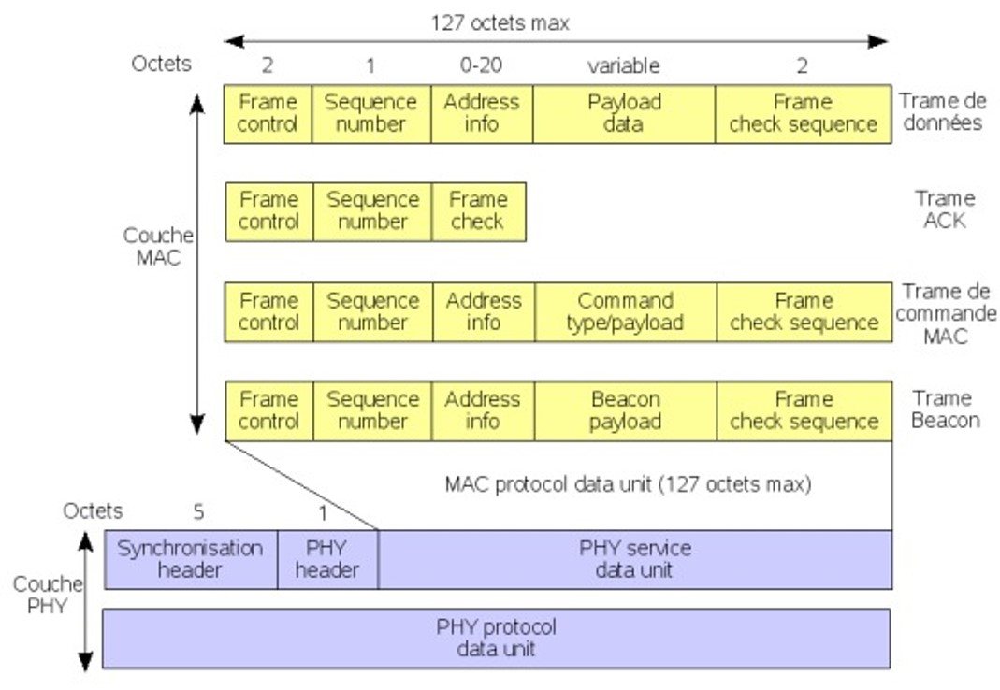
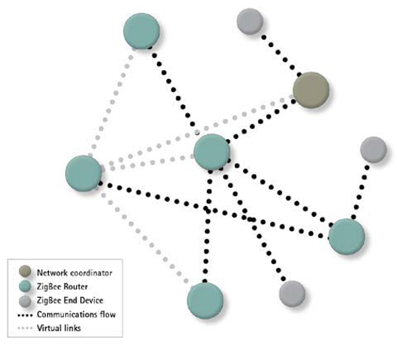
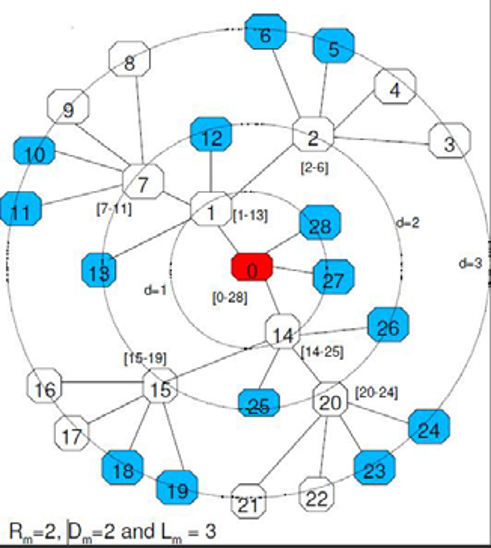
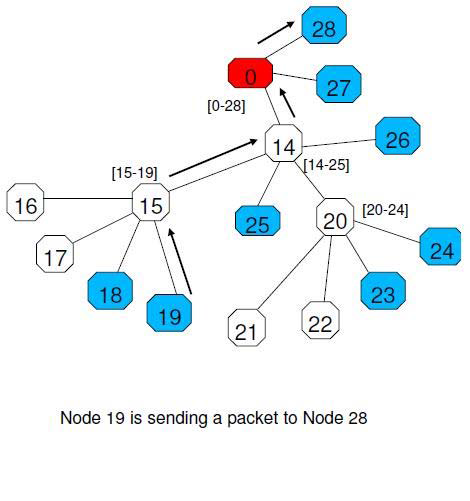

Zigbee est un protocole de communication sans fil à faible consommation d'énergie et à courte portée, utilisé pour connecter des équipements électroniques entre eux. Il a été développé pour répondre aux besoins des réseaux de capteurs sans fil et des applications de l'Internet des Objets (IoT).

## Généralités

- Faible consommation d'énergie
- Sécurisé et fiable
- Peu coûteux
- Basé sur la norme IEEE 802.15.4 pour les réseaux à faible consommation d'énergie

Ce protocole existe depuis 1998 et a été normalisé en 2003 et 2006.

## Caractéristiques techniques

| Caractéristique | Description |
| --- | --- |
Portée réelle | De 10m à 100m |
Portée en extérieur | Jusqu'à 400m |
Débit | 20, 40, 250 kbps |
Latence | 30ms / 15ms (délai de réveil) |
Fréquences | 868 MHz, 915 MHz, 2.4 GHz |
Autonomie | Plusieurs années |
Sécurité | AES 128 bits |
Complexité | Faible |
Topologie | Etoile, maillée et Adhoc |
Nombre de nœuds | 65 536 |
Routage | Oui (mais pas obligatoire) |
Prix | Faible |
Méthode d'accès au support | CSMA-CA ou CSMA-CA slotté |
Fiabilité | Oui (avec acquittement) |

C'est un protocole très fiable, adaptable et flexible. Il est utilisé dans de nombreux domaines, comme la domotique, la gestion de l'énergie, la surveillance de l'environnement, la sécurité et la santé.

## Aspects réseau

Deux couches : 
- La couche réseau : gère la communication entre les nœuds (réseau et transport)
- La couche physique : gère la transmission des trames (Physique et MAC)

### Couche physique

Le Zigbee utilise 4 types de trames : 
- Données : encapsule les données des couches supérieures
- ACK 
- Balise : utilisée pour la synchronisation (envoyée par le nœud coordonnateur)
- Commande : utilisée pour le contrôle des nœuds

**Les trames** : 

Chaque nœud possède une adresse 64 et pour optimiser le champ d'adresse de la trame, la couche réseau utilise une adresse 16 bits. L'allocation se fait de manière aléatoire ou hiérarchique.

### Couche réseau

La couche réseau gère l'établissement d'un nouveau réseau, la configuration des nœuds, l'adressage, la synchronisation, le routage et la sécurité.

Tous les composants d'un réseau communiquent ensemble dans la limite de leur portée. 

On distingue 3 types d'équipements Zigbee :
- Nœud coordonnateur (ZC) : 
    - Racine du réseau et passerelle vers les autres réseaux
    - Synchronisation et de la configuration du réseau. 
    - Alimentation permanente
- Le routeur ZigBee (ZR) : 
    - Equipement intermédiaire
    - route les paquets au sein du réseau (extension de l'étendue du réseau, routes de secours en cas de congestion ou de panne)
    - Alimentation permanente
    - Exemple : lampe
- L'équipement terminal Zigbee (ZED)
    - Ne communique qu'avec un routeur ou le coordinateur
    - Endormi la plupart du temps
    - Exemple : interrupteur

**Exemple de réseau Zigbee** :

2 types de noeuds :

- FFD (Full Function Device) : 
    - Toute topologie
    - Communication avec d'autres nœuds
- RFD (Reduced Function Device) : 
    - Topologie en étoile uniquement
    - Communication avec le nœud coordonnateur uniquement
    - Equipement terminal seulement 

**Topologie maillée** :

La topologie maillée est la plus utilisée. Elle permet de connecter tous les équiepements par plusieurs chemins.

Avantages : 
- Choix du chemin le plus court
- Redondance
- Extensibilité

Inconvénients :
- Complexité

#### Cas du no routage

- Topologie en étoile (equipements connectés au nœud coordonnateur)
- Le nœud coordonnateur est le seul à pouvoir communiquer avec les autres nœuds, tous les autres nœuds ne peuvent communiquer qu'avec le nœud coordonnateur

#### Routage arborescent

Le Zigbee peut fonctionner en mode routage arborescent. Dans ce cas, les nœuds peuvent communiquer entre eux.

Caractéristiques :
- Topologie en arbre
- 1 et 1 seul noeud parent
- Pas de table de routage
- Routage défini lors de l'attribution de l'adresse (pas souple)

**Allocation d'adresse** :

- 3 constantes :
  - Rm : nombre maximum de routeurs
  - Dm : nombre maximum de nœuds terminaux
  - Lm : profondeur maximale de l'arbre
- L'adresse dépend de la position dans l'arbre
- Chaque nœud prend la plus petite adresse disponible
- Chaque routeur (coordinateur inclus) alloue une adresse en fonction de sa plage d'adresses qui dépend de sa position dans l'arbre

Règles du calcul du nombre d'adresses associées à un routeur de niveau d < Lm :
- Si d = Lm - 1 --> A(d)= 1 + Dm + Rm
- Si 0 <= d < Lm - 1 --> A(d) = 1 + Dm + Rm * A(d+1)

**Fonctionnement** :
- Les routeurs connaissent leurs adresses et celles de leurs enfants/parents
- Si la destination est un enfant, le paquet est routé directement
- Si la destination n'est pas un enfant, le paquet est routé vers le parent

