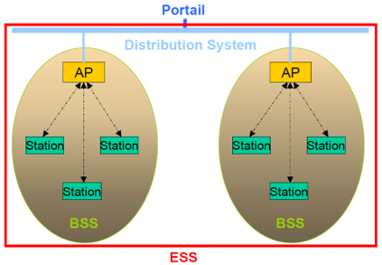
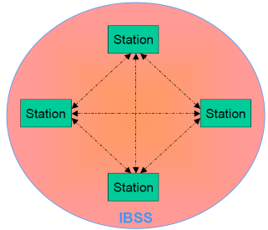
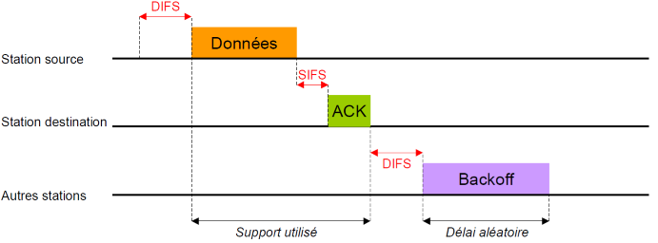
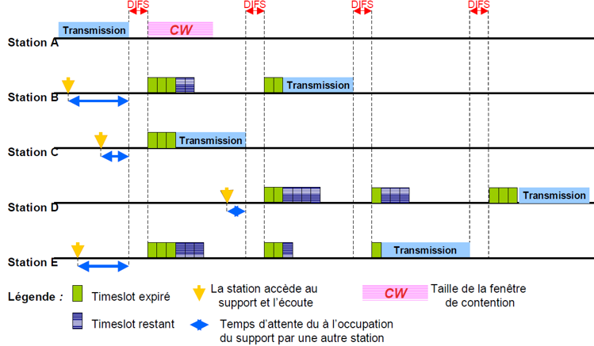

Le WIFI correspond à la norme IEEE 802.11. C'est un réseau avec une architecture  cellulaire : associations de terminaux pour établir des communications. 

2 modes de fonctionnement :
- Mode infrastructure : les terminaux sont reliés à un point d'accès (AP)
- Mode ad-hoc : les terminaux sont reliés entre eux

# Mode infrastructure

Fournit aux différentes stations des services spécifiques sur une zone de couverture déterminée par la taille du réseau.

- Réseaux d'infrastructure établis en utilisant des points d'accès ou Access Points (AP), qui jouent le rôle de station de base pour un BSS
- Chaque BSS est relié à un système de distribution ou DS (Distribution System) par l'intermédiaire de leur point d'accès (AP) respectif
- Système de distribution : en général un réseau Ethernet utilisant du câble métallique
- Groupe de BSS interconnectés par un DS = ESS (Extended Set Service)

## Rôle du DS (Distribution System)

- Le système de distribution (DS) est responsable du transfert des paquets entre différents BSS d'un même ESS
- DS implémenté de manière indépendante de la structure hertzienne de la partie sans fil
- Le DS peut correspondre à un réseau Ethernet, Token Ring, FDDI (Fiber Distributed Data Interface) ou un autre IEEE 802.11

## Rôle de l'ESS (Extended Service Set)

- L'ESS peut aussi fournir aux différentes stations mobiles une passerelle d'accès vers un réseau fixe, tel qu'Internet
- Passerelle : connexion du réseau 802.11 à un autre réseau

## Mode ad-hoc

- Groupe de terminaux formant un IBSS (Independent Basic Set Service)
- Rôle : permettre aux stations de communiquer sans l'aide d'une quelconque infrastructure telle qu'un point d'accès ou une connexion au système de distribution
- Chaque station peut établir une communication avec n'importe quelle autre station dans l'IBSS
- Pas de point d'accès : les stations n'intègrent qu'un certain nombre de fonctionnalités
- Mode très utile pour mettre en place facilement un réseau sans fil lorsqu'une infrastructure sans fil ou fixe fait défaut

# Méthode d'accès

Le CSMA/CA est basé sur :
- L’utilisation d’acquittements positifs
    - ACK envoyé par la station destination pour confirmer que les données sont reçues de manière intacte
- Les temporisateurs IFS (Inter-Frame Spacing)
- Période d’inactivité sur le support de transmission de 2 trames
- L’écoute du support
- L’algorithme de Backoff

# Ecoute du support

- La station voulant émettre écoute le support
  - Si aucune activité n'est détectée pendant un DIFS, transmission immédiate des données
  - Si le support est occupé, la station écoute jusqu'à ce qu'il soit libre
    - Quand le support est disponible, la station retarde sa transmission en utilisant l'algorithme de backoff avant de transmettre
- Si les données ont été reçues de manière intacte (vérification du CRC de la trame), la station destination attend pendant un SIFS et émet un ACK
  - Si l'ACK n'est pas détecté par la source ou si les données ne sont pas reçues correctement, on suppose qu'une collision s'est produite et le trame est retransmise

# Algorithme de Backoff

- Permet de résoudre le problème de l'accès au support lorsque plusieurs stations veulent transmettre des données en même temps
  - Temps découpé en tranches (timeslots)
  - Timeslot de 802.11 un peu plus petit que la durée de transmission minimale d'une trame ; utilisé pour définir les intervalles IFS
- Initialement, une station initialise son timer backoff à entre 0 et 7
- Lorsque le support est libre, le timer est décrémenté jusqu'à ce que le support soit occupé ou que le temporisateur atteigne la valeur 0
  - Si le temporisateur n'a pas atteint la valeur 0 et que le support est de nouveau occupé, la station bloque le temporisateur
  - Dès que le temporisateur atteint 0, la station transmet sa trame
  - Si 2 ou plusieurs stations atteignent la valeur 0 au même instant, une collision se produit et chaque station doit regénérer un nouveau temporisateur, compris entre 0 et 15
  - Pour chaque tentative de retransmission, le temporisateur croît de la façon suivante : [2 2+1 * randf()] * timeslot

- Avantage du Backoff : Les stations ont la même probabilité d'accéder au support 
- Inconvénient : pas de garantie de délai minimal (Complique la prise en charge d'applications temps réel telles que la voix ou la vidéo)

# Sécurité

- Accès au réseau : Service Set ID (SSID) / Access Control List (ACL)
- Wired Encryption Privacy (WEP) : Mécanisme de chiffrement basé sur le RC4 (Confidentialité, Contrôle d’accès, Intégrité).
- Authentification : Open System Authentication / Shared Key AuthenticationA

- Problèmes de sécurité : Tous les mécanismes de sécurité peuvent être déjoués

- Ces attaques sont difficiles à détecter.
    - Les ondes pouvant traverser les murs, avec une antenne, un attaquant peut espionner les trafics dans un périmètre de 100 mètres.
    - Plusieurs attaques possibles : Accès non autorisé / Modification des messages / Attaque par dictionnaire / …
- 15 minutes pour casser une clé de 40 bits en attaque passive, pas beaucoup plus long pour une clé de 128 bits !

- Solutions :
- WEP +
- 802.1x avec EAP (Extended Authentication Protocol) depuis 2001
- WPA2 (802.11i basé sur AES (Advanced Encryption Standard)) depuis 2004