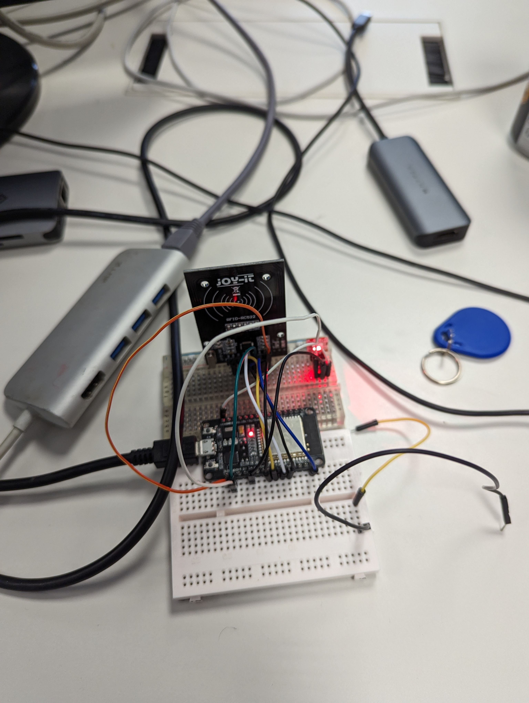
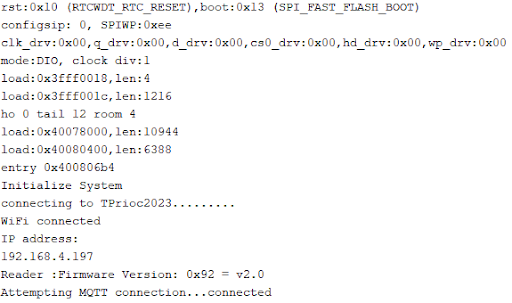
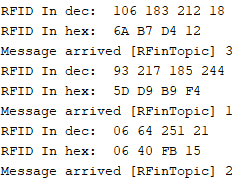
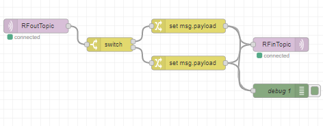
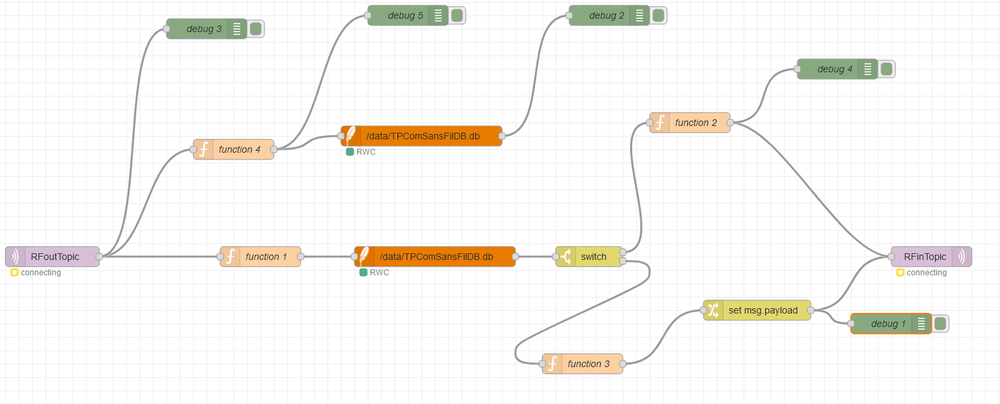
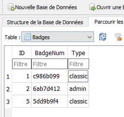
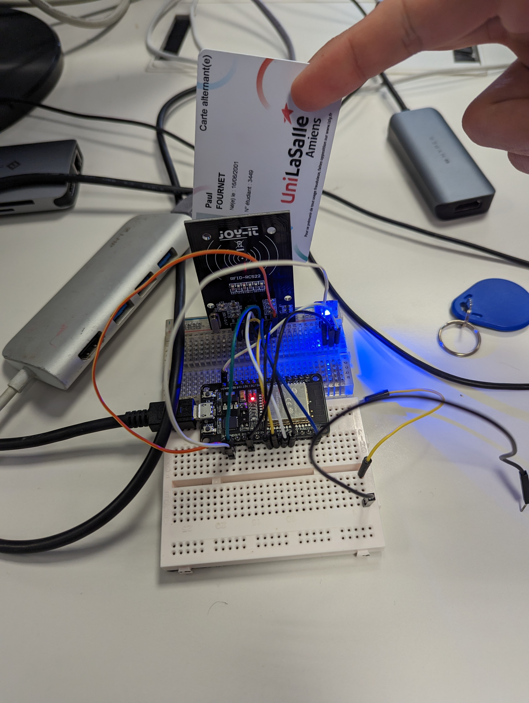

**Groupe** : FOURNET Paul - ROHEE Guillaume  
**Date** : 07/04/2023

# Rapport de TP - Système de badge intelligent

Le TP proposé dans le cadre de la matière Communication sans fil consiste à mettre en place un système de badge intelligent en utilisant les technologies **RFID**, **MQTT**, **Node-Red**, **Sqlite** et une carte **ESP32**.

**Plusieurs étapes devaient être réalisées** : 

* Branchement des composants sur la carte
* Modification du code source C de l'ESP32
* Création d'un serveur Node-Red et création d'un flux pour la gestion des badges
* Ajout d'une badge de données dans la base de données
* Gérer l'ajout d'un nouveau badge dans la base de données

## Branchement des composants sur la carte

Sur la carte ESP32, plusieurs composants devaient être branchés :
* Un lecteur de carte RFID
* Une LED

Les branchements pour le lecteur RFID sont les suivants :
- VCC -> 3.3V
- RST -> D5
- GND -> GND
- MISO -> D19
- MOSI -> D23
- SCK -> D18
- NSS -> D21

Les branchements pour la LED sont les suivants :
- 5V -> VIN
- GND -> GND
- DIN -> D4 (PIN 4)

Aperçu des branchements de la carte ESP32 :  


## Modification du code source C de l'ESP32

Lorsque les branchements sont effectués, il faut modifier le code source C de l'ESP32 pour qu'il puisse lire les badges RFID, gérer la connexion au serveur MQTT et l'allumage de la LED.  
Le code source de base pour chaque élément était déjà fourni mais nous devions ajouter les bibliothèques nécessaires et rassembler les codes pour qu'ils fonctionnent ensemble sur la carte. 

### Ajout de la carte ESP32 dans l'IDE Arduino

La carte ESP32 doit être ajoutée dans l'IDE Arduino pour pouvoir compiler le code source C. Pour cela, il faut suivre les étapes suivantes :
- Copier le lien suivant dans le navigateur : https://dl.espressif.com/dl/package_esp32_index.json
- Ouvrir l'IDE Arduino
- Se rendre dans le menu Fichier > Préférences
- Coller le lien dans la case "URL de gestionnaire de cartes supplémentaires"
- Cliquer sur OK

L'ajout permet désormais de paramétrer l'IDE Arduino pour la carte ESP32.

### Installation des bibliothèques

Pour pouvoir utiliser les différents éléments, il faut installer les bibliothèques nécessaires. Elles sont disponibles dans le gestionnaire de bibliothèques de l'IDE Arduino, ou directement téléchargeables sur le dépôt GitHub de l'auteur.

Nous avons installé les bibliothèques suivantes :
- **Adafruit NeoPixel** : pour le contrôle de la LED 
- **MFRC522** : pour le contrôle du lecteur RFID (lien dans le code : https://github.com/miguelbalboa/rfid)
- Bibliothèques pour la connexion au serveur MQTT : **WiFi** (déjà installée)

### Assemblage des codes sources en un seul fichier C

Pour pouvoir compiler le code source C correspondant à chaque device, il faut rassembler les différents codes en un seul.

Code source rassemblé :  
```c
// NeoPixel Ring simple sketch (c) 2013 Shae Erisson
// Released under the GPLv3 license to match the rest of the
// Adafruit NeoPixel library
//Libraries
#include <SPI.h>//https://www.arduino.cc/en/reference/SPI
#include <MFRC522.h>//https://github.com/miguelbalboa/rfid
#include <Adafruit_NeoPixel.h>
#include <PubSubClient.h>
#include <WiFi.h>
#include <WiFiMulti.h>

#ifdef __AVR__
#include <avr/power.h> // Required for 16 MHz Adafruit Trinket
#endif

// Which pin on the Arduino is connected to the NeoPixels?
#define PIN        4 // On Trinket or Gemma, suggest changing this to 1

// How many NeoPixels are attached to the Arduino?
#define NUMPIXELS 1 // Popular NeoPixel ring size
//Constants
#define SS_PIN 21
#define RST_PIN 5
Adafruit_NeoPixel pixels(NUMPIXELS, PIN, NEO_GRB + NEO_KHZ800);

//Parameters
const int ipaddress[4] = {103, 97, 67, 25};

//Variables
byte nuidPICC[4] = {0, 0, 0, 0};
MFRC522::MIFARE_Key key;
MFRC522 rfid = MFRC522(SS_PIN, RST_PIN);

WiFiClient espClient;
PubSubClient client(espClient);


const char*  ssid = "TPrioc2023";
const char* password = "RIOC_2023";
const char* mqtt_server = "192.168.4.1";

// Update these with values suitable for your network.
byte mac[]    = {  0xDE, 0xED, 0xBA, 0xFE, 0xFE, 0xED };

int ledRFIDCheck = 0; // Pour gérer la couleur des leds

void callback(char* topic, byte* payload, unsigned int length) {
  String payloadstr;
  Serial.print("Message arrived [");
  Serial.print(topic);
  Serial.print("] ");
  for (int i=0;i<length;i++) {
    Serial.print((char)payload[i]);
    payloadstr += (char)payload[i];  
  }
  
  if ( payloadstr == "2"){
      ledRFIDCheck = 2;
    }else if( payloadstr == "1"){
      ledRFIDCheck = 1;
    } 
    else if( payloadstr == "3"){
      ledRFIDCheck = 3;
    } 

  Serial.println();
}

void reconnect() {
  // Loop until we're reconnected
  while (!client.connected()) {
    Serial.print("Attempting MQTT connection...");
    // Attempt to connect
    if (client.connect("RoheeFournet")) {
      Serial.println("connected");
      // Once connected, publish an announcement...
      client.publish("RFoutTopic","hello world");
      // ... and resubscribe
      client.subscribe("RFinTopic");
    } else {
      Serial.print("failed, rc=");
      Serial.print(client.state());
      Serial.println(" try again in 5 seconds");
      // Wait 5 seconds before retrying
      delay(5000);
    }
  }
}

void connectToWiFi() {
  delay(100);
  Serial.print("connecting to ");
  Serial.print(ssid);
  WiFi.mode(WIFI_STA);
  WiFi.begin(ssid, password);

  while (WiFi.status() != WL_CONNECTED) {
    delay(500);
    Serial.print(".");
  }
  Serial.println("");
  Serial.println("WiFi connected");
  Serial.println("IP address: ");
  Serial.println(WiFi.localIP());

}

void setup() {
    // These lines are specifically to support the Adafruit Trinket 5V 16 MHz.
  // Any other board, you can remove this part (but no harm leaving it):

  // END of Trinket-specific code.

  pixels.begin(); // INITIALIZE NeoPixel strip object (REQUIRED)
  //Init Serial USB
  Serial.begin(115200);
  Serial.println(F("Initialize System"));
  //init rfid D8,D5,D6,D7
  SPI.begin();
  rfid.PCD_Init();

  connectToWiFi();

  delay(1000);

  client.setServer(mqtt_server, 1883);
  client.setCallback(callback);
  Serial.print(F("Reader :"));
  rfid.PCD_DumpVersionToSerial();
}

void loop() {
  readRFID();
 

  if (ledRFIDCheck == 1){
    pixels.setPixelColor(0, pixels.Color(0, 255, 0));
    ledRFIDCheck = 0;

  }
  
  else if (ledRFIDCheck == 2){
    pixels.setPixelColor(0, pixels.Color(255, 0, 0));
    ledRFIDCheck = 0;
  }

  else if (ledRFIDCheck == 3){
    pixels.setPixelColor(0, pixels.Color(0, 0, 255));
    ledRFIDCheck = 0;
  }

//  else if (ledRFIDCheck == 0){
//    pixels.setPixelColor(0, pixels.Color(0, 0, 0));
//  }

  
 /*
    if ((char)payload[12] == 2){
        pixels.setPixelColor(0, pixels.Color(0, 255, 0));
        delay(2000);
        pixels.clear();
    }else if(topic[12] == 1){
        pixels.setPixelColor(0, pixels.Color(0, 0, 255));
        delay(2000);
        pixels.clear();
      
    }

    */

    

  // pixels.Color() takes RGB values, from 0,0,0 up to 255,255,255
  // Here we're using a moderately bright green color:

  pixels.show();   // Send the updated pixel colors to the hardware.

  if (!client.connected()) {
    reconnect();
  }
  client.loop();

}

void readRFID(void ) { /* function readRFID */
  ////Read RFID card

  for (byte i = 0; i < 6; i++) {
    key.keyByte[i] = 0xFF;
  }
  // Look for new 1 cards
  if ( ! rfid.PICC_IsNewCardPresent())
    return;

  // Verify if the NUID has been readed
  if (  !rfid.PICC_ReadCardSerial())
    return;

  // Store NUID into nuidPICC array
  for (byte i = 0; i < 4; i++) {
    nuidPICC[i] = rfid.uid.uidByte[i];
  }

  //rfid.PICC_DumpToSerial(&(rfid.uid));
  Serial.print(F("RFID In dec: "));
  printDec(rfid.uid.uidByte, rfid.uid.size);
  Serial.println();
  
  Serial.print(F("RFID In hex: "));
  printHex(rfid.uid.uidByte, rfid.uid.size);
  Serial.println();

  String uidString = "";
  for(byte i=0; i<rfid.uid.size;i++){
    uidString += String(rfid.uid.uidByte[i],HEX);  
  }
  client.publish("RFoutTopic",uidString.c_str());
  // Halt PICC
  rfid.PICC_HaltA();

  // Stop encryption on PCD
  rfid.PCD_StopCrypto1();

}


/**
   Helper routine to dump a byte array as hex values to Serial.
*/
void printHex(byte *buffer, byte bufferSize) {
  for (byte i = 0; i < bufferSize; i++) {
    Serial.print(buffer[i] < 0x10 ? " 0" : " ");
    Serial.print(buffer[i], HEX);
  }
}

/**
   Helper routine to dump a byte array as dec values to Serial.
*/
void printDec(byte *buffer, byte bufferSize) {
  for (byte i = 0; i < bufferSize; i++) {
    Serial.print(buffer[i] < 0x10 ? " 0" : " ");
    Serial.print(buffer[i]);
  }
}
```	

Ce code permet de lire la carte RFID et de publier le UID sur le topic "RFoutTopic" et de recevoir un message sur le topic "RFinTopic" pour allumer la led verte, rouge ou bleu. 

Il ne faut pas oublier de paramétrer la sortie série en 115200 bauds et de mettre le bon SSID.

**Sortie série :**





## Gestion des badges avec Node-RED

Le but du TP est de concevoir un systèmes permettant d'enregistrer des badges RFID dans une base de données. Si le badge est enregistré, la led verte s'allume. Si le badge n'est pas enregistré, la led rouge s'allume.

### Installation de Node-RED

Node-RED est un outil de développement de workflow graphique pour l'Internet des objets. Il permet de créer des applications de bout en bout en reliant des composants logiciels entre eux. Il est basé sur le langage JavaScript et est exécuté dans un environnement Node.js.

Plusieurs options d'installation sont possibles :
- Dans une machine virtuelle exécutée sous VirtualBox
- Dans un conteneur Docker

Le choix s'est porté sur l'installation de Node-RED dans un conteneur Docker car il s'agit d'une solution simple et rapide à mettre en place.

**Fichier docker-compose.yml** :

```yaml
version: "3.7"
services:
  node-red:
    image: nodered/node-red:latest
    container_name: node-red
    ports:
      - "1880:1880"
    volumes:
      - ./data:/data
```

Le Node-RED est accessible à l'adresse suivante du PC hôte sur le port 1880. Le montage d'un volume permet de sauvegarder les données de Node-RED sur la machine hôte afin de ne pas les perdre en cas de redémarrage du conteneur.

### Configuration d'un flux Node-RED

L'objectif du flux Node-RED est de recevoir les UID des badges et de les comparer avec ceux enregistrés dans la base de données. Si l'UID reçu correspond à un badge enregistré, la LED verte s'allume. Si l'UID reçu ne correspond à aucun badge enregistré, la LED rouge s'allume. Si l'UID reçu correspond à un badge enregistré mais que la date d'expiration est dépassée, la LED bleue s'allume.

#### Premier flux

Dans un premier temps, nous avons créé un flux qui permet de recevoir les UID des badges et de renvoyer "1" si l'UID correspond au badge choisi ou "2" si l'UID ne correspond à aucun badge enregistré. Côté code Arduino, selon le message reçu, la LED verte s'allume ou la LED rouge s'allume.



Le bloc "RFoutTopic" permet de recevoir les éléments publiés sur le topic "RFoutTopic" par le code Arduino.

Le contrôle de l'identifiant RFID reçu est effectué dans le bloc "Switch" en comparant l'identifiant reçu avec celui enregistré dans la base de données. Si l'identifiant reçu correspond à celui enregistré, le message "1" est renvoyé via le "set msg.payload", sinon le message "2" est renvoyé (second bloc "set msg.payload").

Enfin, le bloc "RFinTopic" permet d'envoyer le message sur le topic "RFinTopic" pour que le code Arduino puisse allumer la LED verte ou la LED rouge.

#### Second flux et base de données

Dans un second temps, nous avons créé un flux qui permet de recevoir le code du badge RFID scanné et de le comparer avec ceux enregistrés dans la base de données. Si le code reçu correspond à un badge enregistré, la LED verte s'allume sinon c'est la LED rouge. Il y a également la possibilité d'ajouter un nouveau badge en scannant un badge "administrateur", la LED bleue s'allume alors et il faut scanner le nouveau badge pour l'enregistrer dans la base.

**Aperçu du flux** :



Ce flux est basé sur les mêmes principes que le premier flux :
- "RFoutTopic" permet de recevoir les éléments publiés sur le topic "RFoutTopic"
- "RFinTopic" permet d'envoyer le message sur le topic "RFinTopic" 

Cependant, des éléments ont été ajoutés ou modifiés pour gérer les interactions avec la base de données : vérification de la présence d'un badge dans la base de données et ajout d'un nouveau badge dans la base de données.

**Vérification de la présence d'un badge dans la base de données** :

Le message arrive dans le bloc "RFoutTopic" et est stocké dans la variable "msg.payload". Le message est envoyé dans les blocs "function 4" et "function 1". Le bloc 4 sera abordé plus tard. Le bloc 1 permet cependant de charger une requête SQL construite à l'aide du code RFID du badge pour vérifier que ce badge existe dans la base de données. 

**Code du bloc function 4** : 

```js
msg.topic = "SELECT * FROM Badges WHERE BadgeNum = '" + msg.payload + "';";
return msg;
```

Cette requête est ensuite envoyée à un bloc de type "sqlite" (extension Node-Red) qui permet d'exécuter une requête sur une base de données **sqlite**. 

Un **switch** permet de contrôler le résultat de la requête : 
- Vide : cela veut dire que le badge n'est pas enregistré
- Non nul : le badge existe

Si le badge n'existe pas, le caractère "2" est envoyé sur le topic MQTT pour allumer la LED rouge. 

S'il existe, il faut vérifier que le badge obtenu est de type "*admin*" ou non. Si c'est le cas, il faut lever le flag "*newBadge*" pour permettre l'ajout d'un nouveau badge dans la base de données. Cette vérification est effectuée dans le bloc "*function 2*". 

**Code du bloc function 2** : 

```js
if (msg.payload[0].Type == "admin"){
    global.set("newBadge", true);
    msg.payload = 3;
}
else{
    global.set("newBadge", false);
    msg.payload = 1;
}

return msg;
```

Le code permet de vérifier, dans le contenu du payload suite à la requête, que le champ "*Type*" correspond à "*admin*". Si c'est le cas, le flag "*newBadge*" est levé et le caractère "3" est envoyé sur le topic MQTT pour allumer la LED bleue. Si ce n'est pas le cas, le flag "*newBadge*" est abaissé et le caractère "1" est envoyé sur le topic MQTT pour allumer la LED verte.

**Aperçu de la base de données** :



Lorsque le flag "*newBadge*" est levé, il faut scanner un nouveau badge pour l'ajouter dans la base de données. Pour cela, il faut scanner le badge administrateur puis le nouveau badge.

Lorsque le nouveau badge est scanné et que le flag "*newBadge*" est levé, le bloc "*function 4*" est exécuté.

**Code du bloc function 4** : 

```js
if (global.get('newBadge') === true){
    msg.topic = "INSERT INTO Badges (BadgeNum, Type) VALUES ('" + msg.payload + "', 'classic');"; 
    global.set('newBadge', false);
    return msg;
}
else{
    return null;
}
```

Le code permet de vérifier que le flag "*newBadge*" est levé. Si c'est le cas, une requête SQL est construite pour ajouter le nouveau badge dans la base de données. Le flag "*newBadge*" est abaissé pour éviter d'ajouter d'autres badges ensuite.

#### Illustration des états de la LED

La LED est rouge si la carte n'est pas reconnue : 


La LED est verte si la carte est reconnue :


La LED est bleue si la carte est reconnue et qu'il s'agit d'une carte administrateur afin de signaler qu'il faut scanner un nouveau badge pour l'ajouter dans la base de données :



## Conclusion

Ce TP a permis de mettre en place une communication sans fil entre une carte ESP32 et un serveur MQTT afin de concevoir un systèmes de contrôle d'accès intelligent basé sur l'utilisation de badges RFID. La sécurité est assuré par le contrôle de la présence du badge dans la base de données à l'aide d'un flux Node-Red.

#### Liens utiles : 

- [Tutoriel UTC pour ESP32](https://fablabutc.fr/wp-content/uploads/2021/01/Tutoriel_ESP32.pdf)
- [SQLite Browser](https://sqlitebrowser.org/dl/)
- [Utiliser SQlite avec NodeRed](http://noderedguide.com/tutorial-sqlite-and-node-red/)
- [Utiliser Node-Red](https://nodered.org/docs/getting-started/local)