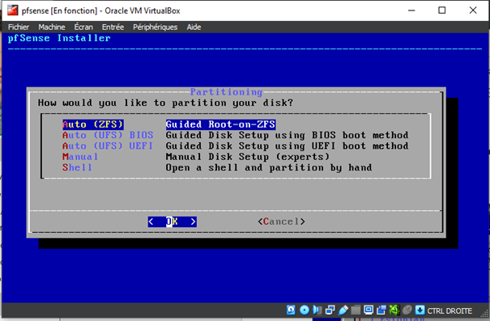
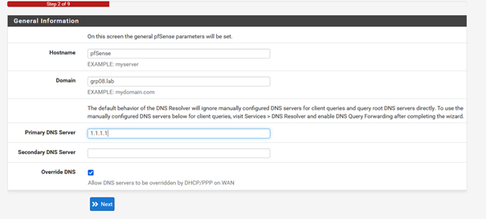
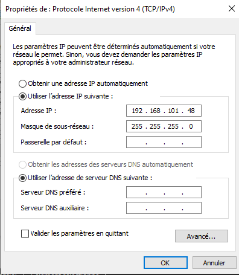

Article relatant la création d'un réseau virtuel de tests pour sysadmin dans le cadre du TP d'administration système de l'*ESIEE Amiens*. Le but est de mettre en place un réseau d'entreprise basique avec un pare-feu, un DHCP, un serveur DNS, un serveur web, un LDAP et un serveur de fichiers.

---

# Pré-requis

- *VMware Workstation Player* ou *Oracle VirtualBox*
- ISO de *pfSense*
- ISO *Ubuntu Server* 20.04
- Connaissances en réseau
- Connaissances de base en linux

**Remarque** : Il est possible d'utiliser *Docker* afin de déployer efficacement les différents services. Cependant, le but de ce TP est de mettre en place un réseau d'entreprise basique avec un pare-feu, un DHCP, un serveur DNS, un serveur web, un LDAP et un serveur de fichiers. Il est donc préférable d'utiliser des machines virtuelles afin de pouvoir les manipuler facilement.

# Aperçu et schéma du réseau

// Faire un schéma

# Configuration du pare-feu

La solution choisie pour ce TP est *pfSense*. Il s'agit d'un pare-feu open source basé sur *BSD*. Il est possible de l'installer sur une machine physique ou virtuelle. Dans ce TP, nous allons l'installer sur une machine virtuelle.

Le pfsense est la machine qui va relier le réseau interne et le réseau externe. Il va donc être configuré en mode routeur. Il va donc avoir deux interfaces réseau : une interface réseau externe et une interface réseau interne.

L'ISO de *pfSense* est disponible sur le site officiel : https://www.pfsense.org/download/. Une fois téléchargée, il faut la monter dans la machine virtuelle. Il faut ensuite démarrer la machine virtuelle et suivre les instructions d'installation.

**Remarque** : sur *Dell XPS*, j'ai eu des soucis avec la carte réseau WIFI qu'il n'est pas possible d'utiliser en réseau "bridgé". J'ai donc du utiliser un adaptateur réseau USB. Il faut donc brancher l'adaptateur réseau USB sur le PC et sélectionner l'inteface réseau correspondante dans la machine virtuelle.

La procédure d'installation est assez trivial. Il suffit de suivre les instructions. Une fois l'installation terminée, il faut configurer le pare-feu. Pour cela, il faut se connecter à l'interface web du pare-feu. La configuration est basique puisqu'il s'agit d'un labo.

## Les étapes en images 

Sélection de l'installation :


Choix de la langue du clavier : 


Choix du mode de partition du disque dur :



Choix du type de disque disque virtuel :


Choix du disque dur et validation:


## Aperçu de la configuration du pare-feu





**Paramétrage de l'interface réseau externe** pour accéder à l'interface web du pare-feu:




Ici, cette carte réseau virtuelle permet au PC d'accéder à l'interface web du pare-feu. Notre PC sera donc virtuellement connecté au réseau virtuel.

# Création d'une machine virtuelle template

- Installer *Ubuntu Server* 20.04
- Finaliser l'installation (changer le mot de passe root, créer un utilisateur, etc., laisser les paramètres par défaut)
- Faire les mises à jour : `sudo apt-get update` / `sudo apt-get upgrade`.
- Changer la configuration réseau dans le fichier /etc/netplan/50-cloud-init.yaml : `sudo nano /etc/netplan/50-cloud-init.yaml`. 
- Une fois les modifications effectuées, il faut appliquer la configuration réseau : `sudo netplan apply`.
- Changer le nom de la machine : `sudo hostnamectl set-hostname <nom-de-la-machine>`.
  
Ce template sera utilisé pour créer les autres machines virtuelles (serveur web, serveur DNS, serveur LDAP, serveur de fichiers, etc.).

# Création d'un serveur DHCP/DNS

- Cloner la machine virtuelle template
- Changer le nom de la machine virtuelle
- Changer l'adresse IP de la machine virtuelle

## Le serveur DHCP

- Installer le serveur DHCP/DNS : `sudo apt-get install isc-dhcp-server`
- Se rendre dans le fichier de configuration du serveur DHCP : `sudo nano /etc/dhcp/dhcpd.conf`
- Adapter les lignes suivantes du fichier de configuration du serveur DHCP :

```bash
subnet 10.5.5.0 netmask 255.255.255.224 {
  range 10.5.5.26 10.5.5.30;
  option domain-name-servers ns1.internal.example.org;
  option domain-name "internal.example.org";
  option subnet-mask 255.255.255.224;
  option routers 10.5.5.1;
  option broadcast-address 10.5.5.31;
  default-lease-time 600;
  max-lease-time 7200;
}
```

Il faut adapter le bloc en fonction du réseau que l'on souhaite créer. Par exemple : 

```bash
subnet 192.168.101.0 netmask 255.255.255.0 {
  range 192.168.101.10 192.168.101.30;
  option domain-name-servers 192.168.101.201;
  option domain-name "grp08.lab";
  option subnet-mask 255.255.255.0;
  option routers 192.168.101.254;
}
```

Il faut ensuite spécifier l'inteface réseau sur laquelle le serveur DHCP va écouter. Pour connaître le nom de l'interface réseau, il faut taper la commande `ip a`. Ensuite, il faut se rendre dans le fichier de configuration du serveur DHCP : `sudo nano /etc/default/isc-dhcp-server`. Il faut ensuite adapter la ligne suivante :

```bash
INTERFACESv4="enp0s3"
```

Le nom change en fonction de l'interface réseau sur laquelle le serveur DHCP va écouter.

Enfin, il faut redémarrer le serveur DHCP : `sudo systemctl restart isc-dhcp-server`. On peut ensuite vérifier le statut du serveur DHCP : `sudo systemctl status isc-dhcp-server`.

Pour la démonstration, on crée une nouvelle machine qui va se connecter au réseau virtuel. On peut voir que la machine virtuelle a bien récupéré une adresse IP du serveur DHCP.

#### Sources

- Cours de l'ESIEE Amiens par Stéphane POMPORTES
- [Créer son lab virtuel avec VirtualBox et PfSense - Youtube IT Connect](https://www.youtube.com/watch?v=NzVDjNqchoc)
- [Comment installer pfsense dans virtualbox pour créer un lab virtuel - IT Connect](https://www.it-connect.fr/comment-installer-pfsense-dans-virtualbox-pour-creer-un-lab-virtuel/)