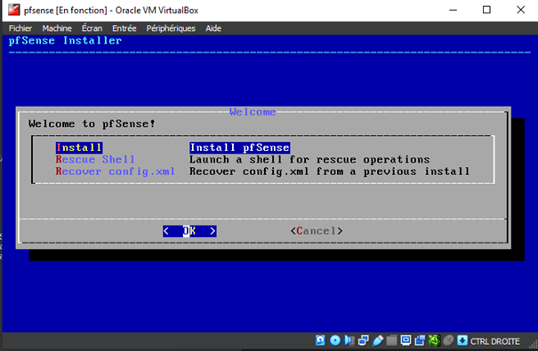
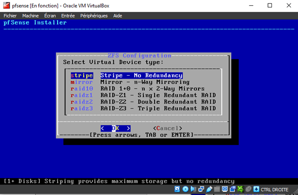
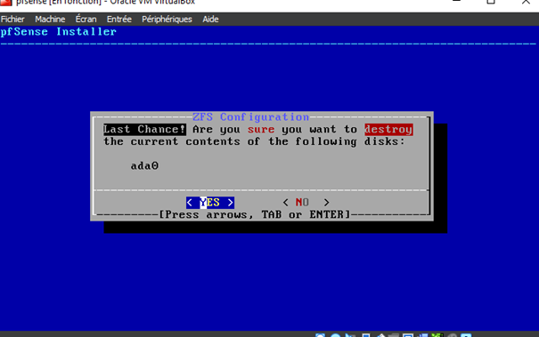
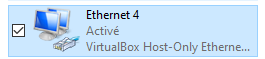

Article relatant la création d'un réseau virtuel de tests pour sysadmin dans le cadre du TP d'administration système de l'*ESIEE Amiens*. Le but est de mettre en place un réseau d'entreprise basique avec un pare-feu, un DHCP, un serveur DNS, un serveur web, un LDAP et un serveur de fichiers.

---

# Pré-requis

- *VMware Workstation Player* ou *Oracle VirtualBox*
- ISO de *pfSense*
- ISO *Ubuntu Server* 20.04
- Connaissances en réseau
- Connaissances de base en linux

**Remarque** : Il est possible d'utiliser *Docker* afin de déployer efficacement les différents services. Cependant, le but de ce TP est de mettre en place un réseau d'entreprise basique avec un pare-feu, un DHCP, un serveur DNS, un serveur web, un LDAP et un serveur de fichiers. Il est donc préférable d'utiliser des machines virtuelles afin de pouvoir les manipuler facilement.

# Aperçu et schéma du réseau

// Faire un schéma

# Configuration du pare-feu

La solution choisie pour ce TP est *pfSense*. Il s'agit d'un pare-feu open source basé sur *BSD*. Il est possible de l'installer sur une machine physique ou virtuelle. Dans ce TP, nous allons l'installer sur une machine virtuelle.

Le pfsense est la machine qui va relier le réseau interne et le réseau externe. Il va donc être configuré en mode routeur. Il va donc avoir deux interfaces réseau : une interface réseau externe et une interface réseau interne.

L'ISO de *pfSense* est disponible sur le site officiel : https://www.pfsense.org/download/. Une fois téléchargée, il faut la monter dans la machine virtuelle. Il faut ensuite démarrer la machine virtuelle et suivre les instructions d'installation.

**Remarque** : sur *Dell XPS*, j'ai eu des soucis avec la carte réseau WIFI qu'il n'est pas possible d'utiliser en réseau "bridgé". J'ai donc du utiliser un adaptateur réseau USB. Il faut donc brancher l'adaptateur réseau USB sur le PC et sélectionner l'inteface réseau correspondante dans la machine virtuelle.

La procédure d'installation est assez trivial. Il suffit de suivre les instructions. Une fois l'installation terminée, il faut configurer le pare-feu. Pour cela, il faut se connecter à l'interface web du pare-feu. La configuration est basique puisqu'il s'agit d'un labo.

## Les étapes en images 

Sélection de l'installation :



Choix de la langue du clavier : 


Choix du mode de partition du disque dur :


Choix du type de disque disque virtuel :



Choix du disque dur et validation:



## Aperçu de la configuration du pare-feu


**Paramétrage de l'interface réseau externe** pour accéder à l'interface web du pare-feu:




Ici, cette carte réseau virtuelle permet au PC d'accéder à l'interface web du pare-feu. Notre PC sera donc virtuellement connecté au réseau virtuel.

# Création d'une machine virtuelle template

- Installer *Ubuntu Server* 20.04
- Finaliser l'installation (changer le mot de passe root, créer un utilisateur, etc., laisser les paramètres par défaut)
- Faire les mises à jour : `sudo apt-get update` / `sudo apt-get upgrade`.
- Changer la configuration réseau dans le fichier /etc/netplan/50-cloud-init.yaml : `sudo nano /etc/netplan/50-cloud-init.yaml`. 
- Une fois les modifications effectuées, il faut appliquer la configuration réseau : `sudo netplan apply`.
- Changer le nom de la machine : `sudo hostnamectl set-hostname <nom-de-la-machine>`.
  
Ce template sera utilisé pour créer les autres machines virtuelles (serveur web, serveur DNS, serveur LDAP, serveur de fichiers, etc.).

# Création d'un serveur DHCP/DNS

- Cloner la machine virtuelle template
- Changer le nom de la machine virtuelle
- Changer l'adresse IP de la machine virtuelle

## Le serveur DHCP

- Installer le serveur DHCP/DNS : `sudo apt-get install isc-dhcp-server`
- Se rendre dans le fichier de configuration du serveur DHCP : `sudo nano /etc/dhcp/dhcpd.conf`
- Adapter les lignes suivantes du fichier de configuration du serveur DHCP :

```bash
subnet 10.5.5.0 netmask 255.255.255.224 {
  range 10.5.5.26 10.5.5.30;
  option domain-name-servers ns1.internal.example.org;
  option domain-name "internal.example.org";
  option subnet-mask 255.255.255.224;
  option routers 10.5.5.1;
  option broadcast-address 10.5.5.31;
  default-lease-time 600;
  max-lease-time 7200;
}
```

Il faut adapter le bloc en fonction du réseau que l'on souhaite créer. Par exemple : 

```bash
subnet 192.168.101.0 netmask 255.255.255.0 {
  range 192.168.101.10 192.168.101.30;
  option domain-name-servers 192.168.101.201;
  option domain-name "grp08.lab";
  option subnet-mask 255.255.255.0;
  option routers 192.168.101.254;
}
```

Il faut ensuite spécifier l'inteface réseau sur laquelle le serveur DHCP va écouter. Pour connaître le nom de l'interface réseau, il faut taper la commande `ip a`. Ensuite, il faut se rendre dans le fichier de configuration du serveur DHCP : `sudo nano /etc/default/isc-dhcp-server`. Il faut ensuite adapter la ligne suivante :

```bash
INTERFACESv4="enp0s3"
```

Le nom change en fonction de l'interface réseau sur laquelle le serveur DHCP va écouter.

Enfin, il faut redémarrer le serveur DHCP : `sudo systemctl restart isc-dhcp-server`. On peut ensuite vérifier le statut du serveur DHCP : `sudo systemctl status isc-dhcp-server`.

Pour la démonstration, on crée une nouvelle machine qui va se connecter au réseau virtuel. On peut voir que la machine virtuelle a bien récupéré une adresse IP du serveur DHCP.

## Le serveur DNS

Dans un premier temps, il faut installer le serveur DNS : `sudo apt-get install bind9`. Il faut également installer le paquet `dnsutils` pour pouvoir utiliser la commande `dig` : `sudo apt-get install dnsutils`. Ensuite, il faut se rendre dans le fichier de configuration du serveur DNS : `sudo nano /etc/bind/named.conf.options`. Il faut ensuite adapter la ligne suivante :

```bash
zone "grp08.lab" {
  type master;
  file "/etc/bind/db.grp08.lab";
};
```

Il faut ensuite créer le fichier de configuration du domaine : `sudo nano /etc/bind/db.grp08.lab`. Il faut ensuite adapter le fichier de configuration du domaine en fonction du réseau que l'on souhaite créer. On peut simplement copier le fichier de configuration du domaine de la machine virtuelle template : `sudo cp /etc/bind/db.local /etc/bind/db.grp08.lab`. Ensuite, il faut adapter le fichier de configuration du domaine en fonction du réseau que l'on souhaite créer.

Il faut ensuite redémarrer le serveur DNS : `sudo systemctl restart bind9`. On peut ensuite vérifier le statut du serveur DNS : `sudo systemctl status bind9`.

## Le serveur LDAP

Le serveur LDAP est une serveur différent. Il faut donc cloner le template, paramétrer son IP et changer son nom. On peut ensuite installer le serveur LDAP : `sudo apt-get install slapd ldap-utils`. 

Il faut aussi installer le paquet `dpkg-reconfigure` pour pouvoir utiliser la commande `dpkg-reconfigure slapd`. Cette commande permet de reconfigurer le LDAP si des éléments ont été omis lors de l'installation (par exemple, le mot de passe de l'administrateur LDAP, le nom du domaine, etc.).

Pour vérifier que le serveur LDAP est bien installé, on peut utiliser la commande `ldapsearch -x -LLL -b dc=nom,dc=lab`. Cette commande permet de lister les éléments du LDAP.

Pour la suite de la configuration du serveur LDAP, on peut utiliser Apache Directory Studio. Cet outil permet de gérer le LDAP et de créer des utilisateurs dans l'annuaire LDAP. Il faut télécharger le logiciel [Apache Directory Studio](https://directory.apache.org/studio/downloads.html). Il faut ensuite lancer le logiciel et se connecter au serveur LDAP. On peut ensuite créer un utilisateur dans le LDAP.

**A savoir** : `Apache Diretory Studio` nécessite Java 11 ou plus. Il faut télécharger le JDK sur le site officiel, puis se rendre dans le répertoire `ProgramFiles` et modifier `ApacheDirectoryStudio.ini` pour ajouter le chemin vers le JDK : 

```bash
-vm
C:\Program Files\Java\jdk-11.0.2\bin
```

Il faut ensuite créer les unités organisationnelles dans le LDAP. Pour cela, il faut constituer un fichier `base.ldif` de ce type :

```bash
dn: ou=Users,dc=ENT-8,dc=loc
objectClass: organizationalUnit
ou: Users

dn: ou=Groups,dc=ENT-8,dc=loc
objectClass: organizationalUnit
ou: Groups

dn: ou=Machines,dc=ENT-8,dc=loc
objectClass: organizationalUnit
ou: Machines
```

Ce fichier permet de créer les unités organisationnelles dans le LDAP. Il peut se situer dans le répertoire personnel de l'utilisateur ldap. 

Il faut ensuite ajouter le fichier `base.ldif` dans le LDAP : `ldapadd -x -D "cn=admin,dc=ENT-8,dc=loc" -W -f base.ldif`. Il faut ensuite entrer le mot de passe de l'administrateur LDAP.

La sortie de la commande doit ressembler à ceci :

```bash
adding new entry "ou=Users,dc=ENT-8,dc=loc"

adding new entry "ou=Groups,dc=ENT-8,dc=loc"

adding new entry "ou=Machines,dc=ENT-8,dc=loc"
```

Dorénavant, le LDAP est configuré. Il faut maintenant passer à la configuration des clients. Pour cela, il faut installer les ldapscripts : `sudo apt-get install ldapscripts` puis les configurer. Il faut ensuite créer un fichier de configuration pour les ldapscripts : `sudo nano /etc/ldapscripts/ldapscripts.conf`. Il peut être prudent de sauvegarder le fichier de configuration par défaut : `sudo cp /etc/ldapscripts/ldapscripts.conf /etc/ldapscripts/ldapscripts.conf.bck`. 

Dans ce fichiers, plusieurs éléments à modifier :

- Décommenter la ligne `SERVER=ldap://` puis ajouter l'adresse IP du serveur LDAP : `SERVER=ldap://<ip_address>`.
- Décommmenter la ligne `SUFFIX=dc=example,dc=com` puis ajouter le nom du domaine : `SUFFIX=dc=ENT-8,dc=loc`.
- Décommenter la ligne `GSUFFIX=ou=Groups`
- Décommenter la ligne `USUFFIX=ou=Users`
- Décommenter la ligne `MSUFFIX=ou=Machines`
- Modifier la ligne `BINDDN=cn=admin,dc=example,dc=com` en `BINDDN=cn=admin,dc=ENT-8,dc=loc` (en fonction du nom du domaine). Ici, on pourrait utiliser un autre utilisateur que l'administrateur LDAP pour des raisons de sécurité.
- Décommenter `USHELL=/bin/sh` et modifier le chemin pour `USHELL=/bin/bash` pour que les utilisateurs aient un shell bash.
- Décommenter `UHOME=/home` et modifier le chemin pour `UHOME=/export/home` pour que les utilisateurs aient un répertoire personnel sur le serveur NFS.
- Pour `CREATEHOMES=no`, il faut mettre `CREATEHOMES=yes` pour que les utilisateurs aient un répertoire personnel.

Il faut ensuite mettre le mot de passe du compte LDAP dans `/etc/ldapscripts/ldapscripts.passwd`. On remplace `secrets` par le mot de passe du compte LDAP. Il faut ensuite s'assurer que seul le root a la persmission d'accéder au fichier. Pour s'en assurer on peut utiliser `sudo chmod 400 /etc/ldapscripts/ldapscripts.passwd`. En cas de problème, on peut utiliser la commande `sudo chmod 600 /etc/ldapscripts/ldapscripts.passwd` pour remettre les droits en écriture.

Si un problème survient pour créer un utilisateur, on peut tenter de passer directement le mot de passe au LDAP. Pour cela, on utiiise `sudo sh -c 'echo -n "<password>" > /etc/ldapscripts/ldapscripts.passwd'`. On peut ensuite créer un groupe avec la commande `sudo ldapaddgroup <group_name>`. On peut ensuite créer un utilisateur avec la commande `sudo ldapadduser <user_name> <group_name>`.

Il faut être vigilant : si un home directory a été paramétré, il faut s'assurer que le répertoire existe sur le serveur NFS. Pour cela, on peut utiliser la commande `sudo mkdir -p /export/home`. Si la commande intervient après la création de l'utilisateur, on peut le supprimer avec la commande `sudo ldapdeleteuser <user_name>`. Il faut ensuite le recréer.

Il faut modifier le mot de passe de l'utilisateur LDAP car celui placé par défaut n'est pas connu. Pour cela, on peut utiliser la commande `sudo ldapsecpasswd`.

#### Sources et documentations

- Cours d'administration systèmes de Stéphane POMPORTES, enseignant chercheur à l'ESIEE Amiens
- [Créer son lab virtuel avec VirtualBox et PfSense - Youtube IT Connect](https://www.youtube.com/watch?v=NzVDjNqchoc)
- [Comment installer pfsense dans virtualbox pour créer un lab virtuel - IT Connect](https://www.it-connect.fr/comment-installer-pfsense-dans-virtualbox-pour-creer-un-lab-virtuel/)
- [Install LDAP - Documentation Ubuntu](https://ubuntu.com/server/docs/service-ldap)
- [Service LDAP usage - Documentation Ubuntu](https://ubuntu.com/server/docs/service-ldap-usage)